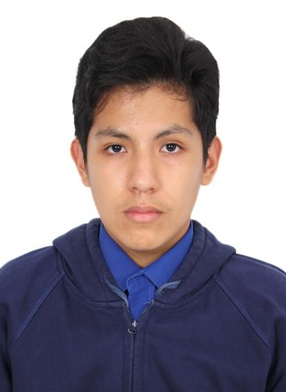
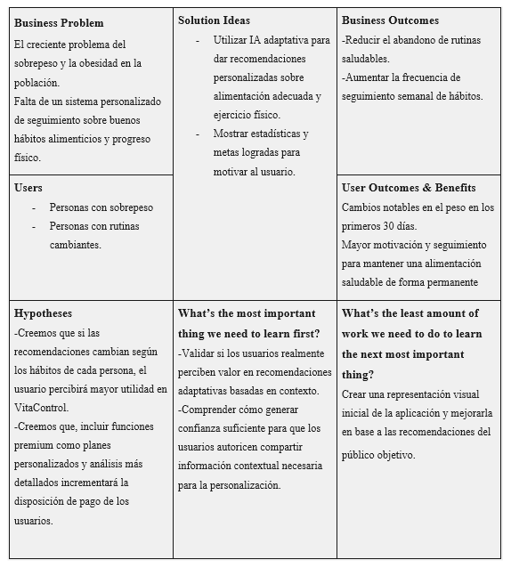

 

  

 
<h2 align="center"><strong>Universidad Peruana de Ciencias Aplicadas</strong></h2>
<h2 align="center"><strong>Carrera de Ingeniería de Software</strong></h2>

<h2 align="center"><strong>1ASI0730</strong></h2>
<h2 align="center"><strong>Aplicaciones Web</strong></h2>
<h2 align="center">NRC</h2>
<h2 align="center"><strong>16129</strong></h2>
<h2 align="center"><strong>Informe del Trabajo</strong></h2>
<h2 align="center">Docente</h2>
<h2 align="center"><strong>Sanchez Seña, Alberto Wilmer</strong></h2>
<h2 align="center">Equipo</h2>
<h2 align="center"><strong>NutriStartup</strong></h2>
<h2 align="center">Proyecto</h2>
<h2 align="center"><strong>NutriApp Integral</strong></h2>

<h2 align="center"><strong>Integrantes:</strong></h2>

  <table align="center">
    <thead>
      <tr>
        <th align="center" >Código</th>
        <th align="center" >Nombre</th>
      </tr>
    </thead>
    <tbody>
      <tr>
        <td align="center" >U202412447</td>
        <td align="center" >Waldo Alonso Portal Inga</td>
      </tr>
      <tr>
        <td align="center" >U202416903</td>
        <td align="center" >Gabriel Alejandro Vilchez Vite</td>
      </tr>
      <tr>
        <td align="center" >U202418250</td>
        <td align="center" >Poly Gabriel Alcantara Baldeon</td>
      </tr>
      <tr>
        <td align="center" >U202316162</td>
        <td align="center" >Giordano Sebastian Trejo Espejo</td>
      </tr>
    </tbody>
  </table>

<h2 align="center"><strong>Período 202620</strong></h2>
<h2 align="center"><strong>Setiembre 2026</strong></h2>

## Registro de Versiones del Informe

| Versión | Fecha       | Autor                           | Descripción de modificación                                                                                                                  |
|---------|-------------|---------------------------------|----------------------------------------------------------------------------------------------------------------------------------------------|
| 1.0     | 07/09/2026  | Waldo Alonso Portal Inga        | Se añadió la descripción de la Startup, la sección perfiles de integrantes, el solution profile y los segmentos objetivo.                    |
| 2.0     | 11/09/2026  | Gabriel Alejandro Vilchez Vite  | Se actualizó la sección de los perfiles de los integrantes y se añadió los objetivos y restricciones que delimitan el alcance del proyecto.  |

## Contenido

### Tabla de contenidos

- [Registro de Versiones del Informe](#registro-de-versiones-del-informe)
- [Project Report Collaboration Insights](#project-report-collaboration-insights)
- [Student Outcome](#student-outcome)
- [Capítulo I: Introducción](#capítulo-i-introducción)
    - [1.1. Startup Profile](#11-startup-profile)
        - [1.1.1. Descripción de la Startup](#111-descripción-de-la-startup)
        - [1.1.2. Perfiles de integrantes del equipo](#112-perfiles-de-integrantes-del-equipo)
    - [1.2. Solution Profile](#12-solution-profile)
        - [1.2.1. Antecedentes y problemática](#121-antecedentes-y-problemática)
        - [1.2.2. Lean UX Process](#122-lean-ux-process)
            - [1.2.2.1. Lean UX Problem Statements](#1221-lean-ux-problem-statements)
            - [1.2.2.2. Lean UX Assumptions](#1222-lean-ux-assumptions)
            - [1.2.2.3. Lean UX Hypothesis Statements](#1223-lean-ux-hypothesis-statements)
            - [1.2.2.4. Lean UX Canvas](#1224-lean-ux-canvas)
    - [1.3. Segmentos objetivo](#13-segmentos-objetivo)
- [Capítulo II: Requirements Elicitation & Analysis](#capítulo-ii-requirements-elicitation-and-analysis)
    - [2.1. Competidores](#21-competidores)
        - [2.1.1. Análisis competitivo](#211-análisis-competitivo)
        - [2.1.2. Estrategias y tácticas frente a competidores](#212-estrategias-y-tácticas-frente-a-competidores)
    - [2.2. Entrevistas](#22-entrevistas)
        - [2.2.1. Diseño de entrevistas](#221-diseño-de-entrevistas)
        - [2.2.2. Registro de entrevistas](#222-registro-de-entrevistas)
        - [2.2.3. Análisis de entrevistas](#223-análisis-de-entrevistas)
    - [2.3. Needfinding](#23-needfinding)
        - [2.3.1. User Personas](#231-user-personas)
        - [2.3.2. User Task Matrix](#232-user-task-matrix)
        - [2.3.3. User Journey Mapping](#233-user-journey-mapping)
        - [2.3.4. Empathy Mapping](#234-empathy-mapping)
    - [2.4. Big Picture EventStorming](#24-big-picture-eventstorming)
    - [2.5. Ubiquitous Language](#25-ubiquitous-language)
- [Capítulo III: Requirements Specification](#capítulo-iii-requirements-specification)
    - [3.1. User Stories](#31-user-stories)
    - [3.2. Impact Mapping](#32-impact-mapping)
    - [3.3. Product Backlog](#33-product-backlog)
- [Capítulo IV: Product Design](#capítulo-iv-product-design)
    - [4.1. Style Guidelines](#41-style-guidelines)
        - [4.1.1. General Style Guidelines](#411-general-style-guidelines)
        - [4.1.2. Web Style Guidelines](#412-web-style-guidelines)
    - [4.2. Information Architecture](#42-information-architecture)
        - [4.2.1. Organization Systems](#421-organization-systems)
        - [4.2.2. Labeling Systems](#422-labeling-systems)
        - [4.2.3. SEO Tags and Meta Tags](#423-seo-tags-and-meta-tags)
        - [4.2.4. Searching Systems](#424-searching-systems)
        - [4.2.5. Navigation Systems](#425-navigation-systems)
    - [4.3. Landing Page UI Design](#43-landing-page-ui-design)
        - [4.3.1. Landing Page Wireframe](#431-landing-page-wireframe)
        - [4.3.2. Landing Page Mock-up](#432-landing-page-mock-up)
    - [4.4. Web Applications UX/UI Design](#44-web-applications-uxui-design)
        - [4.4.1. Web Applications Wireframes](#441-web-applications-wireframes)
        - [4.4.2. Web Applications Wireflow Diagrams](#442-web-applications-wireflow-diagrams)
        - [4.4.3. Web Applications Mock-ups](#443-web-applications-mock-ups)
        - [4.4.4. Web Applications User Flow Diagrams](#444-web-applications-user-flow-diagrams)
    - [4.5. Web Applications Prototyping](#45-web-applications-prototyping)
    - [4.6. Domain-Driven Software Architecture](#46-domain-driven-software-architecture)
        - [4.6.1. Design-Level EventStorming](#461-design-level-eventstorming)
        - [4.6.2. Software Architecture Context Diagram](#462-software-architecture-context-diagram)
        - [4.6.3. Software Architecture Container Diagrams](#463-software-architecture-container-diagrams)
        - [4.6.4. Software Architecture Components Diagrams](#464-software-architecture-components-diagrams)
    - [4.7. Software Object-Oriented Design](#47-software-object-oriented-design)
        - [4.7.1. Class Diagrams](#471-class-diagrams)
    - [4.8. Database Design](#48-database-design)
        - [4.8.1. Database Diagrams](#481-database-diagrams)
- [Capítulo V: Product Implementation, Validation & Deployment](#capítulo-v-product-implementation-validation-and-deployment)
    - [5.1. Software Configuration Management](#51-software-configuration-management)
        - [5.1.1. Software Development Environment Configuration](#511-software-development-environment-configuration)
        - [5.1.2. Source Code Management](#512-source-code-management)
        - [5.1.3. Source Code Style Guide & Conventions](#513-source-code-style-guide-and-conventions)
        - [5.1.4. Software Deployment Configuration](#514-software-deployment-configuration)
    - [5.2. Landing Page, Services & Applications Implementation](#52-landing-page-services-and-applications-implementation)
    - [5.3. Validation Interviews](#53-validation-interviews)
        - [5.3.1. Diseño de Entrevistas](#531-diseño-de-entrevistas)
        - [5.3.2. Registro de Entrevistas](#532-registro-de-entrevistas)
        - [5.3.3. Evaluaciones según heurísticas](#533-evaluaciones-según-heurísticas)
    - [5.4. Video About-the-Product](#54-video-about-the-product)
- [Conclusiones](#conclusiones)
    - [Conclusiones y recomendaciones](#conclusiones-y-recomendaciones)
    - [Video About-the-Team](#video-about-the-team)
- [Bibliografía](#bibliografía)
- [Anexos](#anexos)

## Student Outcome

| Criterio Específico                                                                                      | Acciones Realizadas                                                                                                                                                                                             | Conclusiones |
|----------------------------------------------------------------------------------------------------------|-----------------------------------------------------------------------------------------------------------------------------------------------------------------------------------------------------------------|--------------|
| **5.c1.** Trabaja en equipo para proporcionar liderazgo en forma conjunta                                | **AV1** - Waldo Alonso Portal Inga:  - Gabriel Alejandro Vilchez Vite:  - Poly Gabriel Aleantara Baldeon:  - Alejandro Franklin Mendoza Vergara:  - Giordano Sebastian Del Ángel Trejo Espejo  | **AV1**   |
| **5.c2.** Crea un entorno colaborativo e inclusivo, establece metas, planifica tareas y cumple objetivos | **AV1** - Waldo Alonso Portal Inga:  - Gabriel Alejandro Vilchez Vite:  - Poly Gabriel Aleantara Baldeon:  - Alejandro Franklin Mendoza Vergara:  - Giordano Sebastian Del Ángel Trejo Espejo  | **AV1**   |

# Capítulo I: Introducción

## 1.1 Startup Profile

### 1.1.1 Descripción de la Startup

VitaControl es una startup que se centra en el bienestar y el cuidado de la salud física y mental que tiene como objetivo ayudar a las personas en la construcción de hábitos saludables y mantenerlos en el tiempo a través de una plataforma digital personalizada. La solución que se ofrece consiste en un conjunto de herramientas de seguimiento, recomendaciones adaptativas y funcionalidades para la alimentación y la actividad física con la cual los usuarios podrán recibir acompañamiento a medida que se ajusta a los usuarios, a medida que sus objetivos, necesidades y características vayan evolucionando.

**Misión**

Ayudar a las personas a construir y mantener hábitos saludables; por medio de una solución digital inteligente, accesible y personalizada que contribuya a mejorar su calidad de vida.

**Visión**

Ser una solución referente en el cuidado de la salud física ,promoviendo estilos de vida saludables mediante tecnología innovadora y personalizada.

### 1.1.2 Perfiles de integrantes del equipo

| Nombre y descripción                                                                                                                                                                                                                                                                                                                                                                                                                | Foto                                                               |
|-------------------------------------------------------------------------------------------------------------------------------------------------------------------------------------------------------------------------------------------------------------------------------------------------------------------------------------------------------------------------------------------------------------------------------------|--------------------------------------------------------------------|
|                                                                                                                                                                                                                                                                                                                                                                                                                                     |                                                                    |
|                                                                                                                                                                                                                                                                                                                                                                                                                                     |                                                                    |
| **Waldo Alonso Portal Inga - U202412447**   Soy estudiante de la carrera de Ingeniería de Software. Me considero una persona capaz, responsable y comprometida con mis objetivos académicos y personales. Siempre estoy motivado por los desafíos y busco siempre aportar valor en los equipos de trabajo en los que participo. Manejo la programación en C++ y Java, cuento con experiencia en la edición de video y/o imágenes |    |
|                                                                                                                                                                                                                                                                                                                                                                                                                                     |                                                                    |
| **Gabriel Alejandro Vilchez Vite - U202416903**   Actualmente estudio la carrera de ingeniería de software y me considero una persona que no deja todos sus trabajos pendientes a última hora y que siempre trata de terminar todos sus trabajos a tiempo. Actualmente tengo conocimientos en matemáticas y en algunos lenguajes de programación como C++ y Matlab. Actualmente estoy estudiando Java.                           |  |

## 1.2 Solution Profile

### 1.2.1 Antecedentes y problemática.

El sobrepeso y la obesidad se han convertido en una problemática creciente de salud pública. Según la Organización Mundial de la Salud (OMS, 2024), 1 de cada 8 personas en el mundo vivía con obesidad en 2022, mientras que la obesidad en adultos se ha más que duplicado desde 1990. Este problema se debe a hábitos alimenticios inadecuados, sedentarismo y dificultades para mantener rutinas saludables de forma constante. Además, muchas personas abandonan dietas y programas de ejercicio por falta de motivación, seguimiento continuo o herramientas accesibles para monitorear su progreso.

Actualmente, existen aplicaciones orientadas al control del peso y hábitos saludables. Sin embargo, muchas de estas ofrecen soluciones poco adaptadas al contexto diario del usuario; por ello, surge la necesidad de una solución que brinde seguimiento personalizado para ayudar a las personas a mantener hábitos saludables y no abandonar sus metas.

**5”W” y 2”H”**

**Who: ¿Quiénes son los usuarios afectados?**
* Adultos y jóvenes que desean seguir rutinas de ejercicio y mantener su motivación para no abandonar sus metas de salud.
* Personas que buscan llevar una alimentación saludable, pero tienen dificultades para sostener hábitos debido a cambios de horario, trabajo o estudios.
* Personas con sobrepeso u obesidad que necesitan seguimiento continuo para controlar su progreso y mejorar su bienestar físico.

**What: ¿Qué problema se busca resolver?**
* Se busca resolver la dificultad de mantener hábitos saludables de manera constante.
* Se busca reducir el abandono frecuente de dietas y rutinas de ejercicio por falta de motivación y seguimiento.

**Where: ¿Dónde ocurre el problema?**
* En entornos donde los cambios de rutina, la falta de tiempo y los estilos de vida sedentarios dificultan mantener hábitos saludables.

**When: ¿Cuándo sucede o se muestra el problema?**
* Cuando las personas inician dietas o rutinas de ejercicio y no logran mantenerlas a largo plazo.
* Cuando suceden cambios en horarios o responsabilidades que dificultan continuar con hábitos saludables.

**Why: ¿Por qué es importante resolver el problema?**
* Es importante prevenir problemas debido al sobrepeso y promover mejores condiciones de salud física.
* Para ayudar a las personas a mantener hábitos saludables de forma continua y no solo temporal.

**How: ¿Cómo se enfrentará el problema?**
* Por medio de una aplicación móvil y página web que permite monitorear la alimentación, actividad física y evolución del progreso del usuario.
* Integración de IA adaptativa  para configurar rutinas y sugerencias alimenticias. Esta IA será entrenada con las respuestas del usuario sobre su edad, sexo, peso, altura, índice de masa corporal (calculada automáticamente), nivel de actividad física, meta deseada, en cuanto tiempo desea cumplir su meta, número de comidas diarias, alimentos frecuentes y presupuesto aproximado.

**How Much: ¿Cuánto es el costo de la solución?**
* La app ofrecerá una versión gratis que incluirá funcionalidades como monitoreo de hábitos, recomendaciones personalizadas por medio de la IA adaptativa.
* Se ofrecerá una versión premium con elementos complementarios, como funcionalidades ampliadas de personalización.
* Se podrá monetizarse por medio de alianzas con nutricionistas, gimnasios o servicios de bienestar integrados a la plataforma.

**Objetivos del proyecto**

**Objetivo general:**
Desarrollar una plataforma digital que ayude a las personas a mejorar y mantener hábitos saludables a través de recomendaciones personalizadas, seguimiento de su avance y herramientas que favorezcan el mantenimiento del mismo con el etiquetado de sus objetivos de alimentación y actividad física.

**Objetivos específicos**
* Ofrecer recomendaciones personalizadas de alimentación y ejercicio, en función de las características, preferencias y objetivos de cada usuario.
* Facilitar el registro y la realización del seguimiento de los hábitos personales de salud y del progreso físico del usuario.
* Incluir recordatorios, objetivos y estadísticas que ayudan a mantener la motivación y a restringir el abandono de los hábitos saludables.
* Incorporar inteligencia artificial adaptativa para modificar las recomendaciones de acuerdo con la información de los hábitos y las necesidades del usuario.
* Poder ofrecer una plataforma que cumpla con los requisitos de la App y de la página web.

**Restricciones del proyecto**
* El proyecto tiene un público objetivo inicial de personas de entre 18 y 50 años que intentan controlar el peso o mejorar sus hábitos saludables.
* La personalización de las recomendaciones dependerá de la información que el usuario vaya introduciendo en el registro y el seguimiento.
* La plataforma se centrará al principio en alimentación, actividad física, seguimiento de hábitos y progreso, una vez más excluyendo cualquier tipo de servicio médico.
* Las recomendaciones de la plataforma no sustituirán la evaluación, el diagnóstico o el tratamiento de los profesionales de la salud.
* El desarrollo inicial estará limitado a la funcionalidad marcada para el MVP, pudiendo incorporar funcionalidades adicionales en futuras versiones.
* El acceso a ciertas funcionalidades podrá depender del tipo de cuenta que el usuario tenga, considerándose una versión gratuita y una versión premium.

### 1.2.2 Lean UX Process

#### 1.2.2.1 Lean UX Problem Statements

El sobrepeso y la obesidad representan una problemática creciente de salud. Según la Organización Mundial de la Salud (2024), la obesidad en adultos se ha duplicado desde 1990. A ello se suman dificultades para mantener hábitos saludables de forma constante, lo que genera abandono de dietas y rutinas por falta de seguimiento y motivación.
 Aunque existen aplicaciones enfocadas en nutrición y actividad física, pocas consideran las rutinas y necesidades cambiantes del usuario. Esto genera una oportunidad para plantear una solución más personalizada y orientada al acompañamiento continuo.
 ¿Cómo podríamos diseñar para que, mediante seguimiento inteligente y recomendaciones adaptativas, las personas cuenten con una herramienta que ayude a mantener sus rutinas saludables y reducir el abandono de sus metas?

Muchas personas buscan mejorar su alimentación y estilo de vida, pero cambios de horario, responsabilidades diarias y falta de constancia dificultan mantener estos hábitos en el tiempo. Además, las soluciones actuales suelen ofrecer recomendaciones generales que no siempre se ajustan a las necesidades y al contexto del usuario.
 Esto evidencia la necesidad de una solución que combine monitoreo, personalización e inteligencia adaptativa para apoyar decisiones saludables en el día a día.
 ¿Cómo podríamos diseñar VitaControl para acompañar a los usuarios en la construcción y continuidad de hábitos saludables mediante recomendaciones contextuales y apoyo personalizado?

#### 1.2.2.2 Lean UX Problem Assumptions

Después de analizar la problemática del sobrepeso, la obesidad y la dificultad para mantener hábitos saludables, se plantean algunos supuestos que nos permitirán proponer soluciones enfocadas en los usuarios. VitaControl busca ayudar a las personas a mejorar su bienestar físico mediante una aplicación inteligente que brinde seguimiento constante, motivación y recomendaciones personalizadas.

**Supuestos sobre los usuarios**
* Se considera que muchas personas desean mejorar su estado físico, pero no logran mantener disciplina por mucho tiempo.
* Se asume que los usuarios necesitan una herramienta práctica que los acompañe diariamente.
* Se cree que jóvenes y adultos usan con frecuencia el celular, por lo que una app sería una opción accesible.
* Se estima que varias personas abandonan dietas o ejercicios por falta de motivación y seguimiento.

**Supuestos sobre el problema**
* La falta de tiempo por estudios o trabajo influye en el abandono de hábitos saludables.
* Muchas personas no saben cómo organizar una rutina adecuada según sus necesidades.
* Existen aplicaciones similares, pero varias no se adaptan al contexto real del usuario.
* El progreso lento genera frustración y desmotivación en quienes buscan bajar de peso.
* La ausencia de control diario dificulta mantener constancia.

**Supuestos sobre la solución VitaControl**
* Una plataforma que combine alimentación, ejercicio y seguimiento sería más útil que usar varias apps separadas.
* Las recomendaciones personalizadas pueden generar mejores resultados que consejos generales.
* Recordatorios y metas cortas pueden mejorar la constancia semanal.
* Mostrar estadísticas y avances ayudaría a mantener la motivación.
* El uso de inteligencia artificial permitiría adaptar rutinas según horarios y hábitos del usuario.

**Resultados esperados del negocio**
* Conseguir una comunidad activa de usuarios durante los primeros meses.
* Posicionar a VitaControl como una opción moderna enfocada en el bienestar físico.
* Generar ingresos mediante versión premium y alianzas estratégicas.
* Diferenciarse de otras aplicaciones por el uso de personalización inteligente.

**Beneficios esperados para el usuario**
* Mejor organización de sus hábitos diarios.
* Mayor motivación para cumplir objetivos personales.
* Seguimiento claro de su progreso físico.
* Recomendaciones adaptadas a su estilo de vida.
* Más control sobre su salud y bienestar.

#### 1.2.2.3 Lean UX Hypothesis Statements

**Hipótesis del Negocio**

**A. Creemos que, al ofrecer una aplicación accesible y fácil de usar para controlar hábitos saludables, aumentará la cantidad de usuarios activos mensuales, lo cual ayudará al crecimiento del proyecto.**
 Sabemos que esto ocurre cuando al menos 60 % de los usuarios registrados permanecen activos después del primer mes.

**B. Creemos que, incluir funciones premium como planes personalizados y análisis más detallados incrementará la disposición de pago de los usuarios.**
 Sabemos que esto ocurre cuando al menos 15 % de usuarios activos migre al plan premium durante los primeros meses.

**C. Creemos que, realizar alianzas con gimnasios y nutricionistas aumentará la confianza en VitaControl y permitirá atraer nuevos usuarios.**
 Sabemos que esto ocurre cuando las alianzas generan un aumento de 20 % en el registro de nuevos usuarios.

**Hipótesis del Usuario**

1. Creemos que si el usuario recibe recordatorios constantes, tendrá mayor compromiso con sus metas de salud.
 Sabremos que esto ocurre cuando al menos un 70% de los usuarios complete sus registros semanales.

2. Creemos que si la aplicación muestra cambios y avances visuales, las personas sentirán mayor motivación para continuar.
 Sabremos que esto ocurre cuando al menos el 60% de los usuarios regresen de forma continua después del primer mes.

3. Creemos que si las recomendaciones cambian según los hábitos de cada persona, el usuario percibirá mayor utilidad en VitaControl.
 Sabremos que esto ocurre cuando al menos el 80% califique positivamente la experiencia personalizada.

4. Creemos que si la app tiene una interfaz clara y rápida, nuevos usuarios podrán utilizarla sin dificultad desde el primer día.
 Sabremos que esto ocurre cuando al menos el 80% de los usuarios completen su registro inicial y primeras acciones sin ayuda externa.

#### 1.2.2.4 Lean UX Canvas

## 1.3 Segmentos objetivos

**Segmento 1: Personas que quieran reducir su peso**

Está conformado por personas entre 18 y 50 años que buscan controlar su peso, mejorar su bienestar físico y recibir acompañamiento para mantener hábitos saludables. Este segmento presenta dificultades para sostener dietas o rutinas de ejercicio de forma constante.

**Segmento 2: Nutricionistas que quieran generar un ingreso extra**

Está constituido por nutricionistas que desean ampliar sus oportunidades profesionales y obtener ingresos a partir de la atención y seguimiento de sus pacientes a partir de herramientas digitales. Este colectivo presenta dificultades a la hora de gestionar correctamente el seguimiento de varias personas, controlar el seguimiento y llevar a cabo planes de alimentación individuales sin modificar sustancialmente su carga de trabajo. La plataforma les permite gestionar la información de sus pacientes, elaborar planes nutricionales, realizar el seguimiento de la evolución de los mismos y, de esta manera, poder atender a más personas y conseguir ampliar las oportunidades de generación de ingresos.

