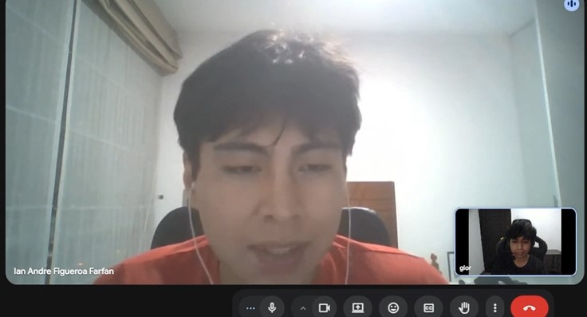
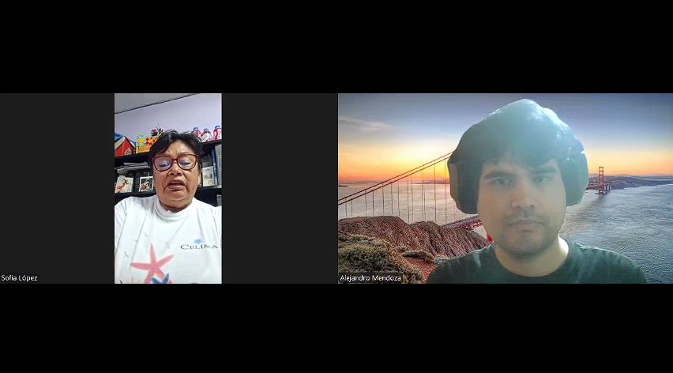
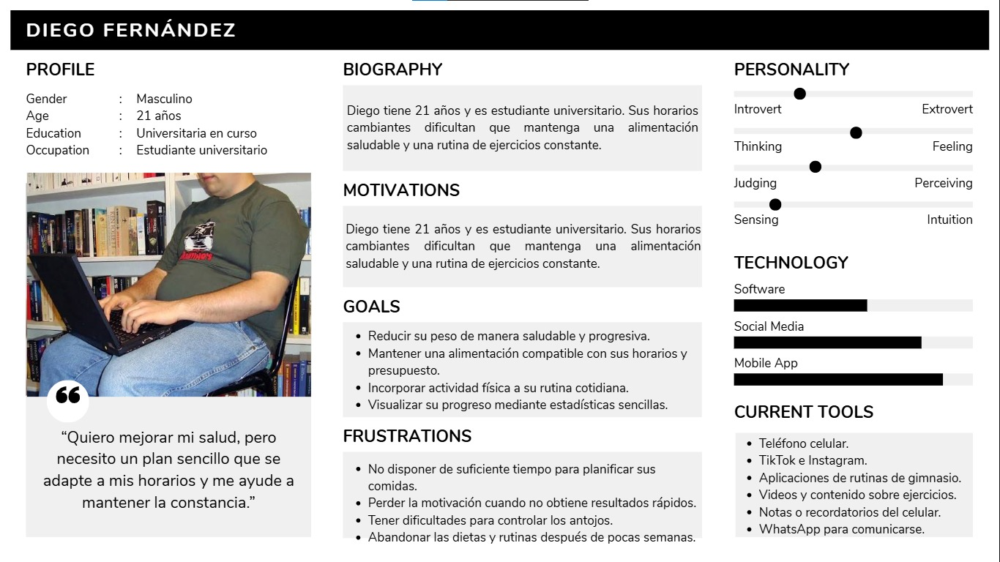
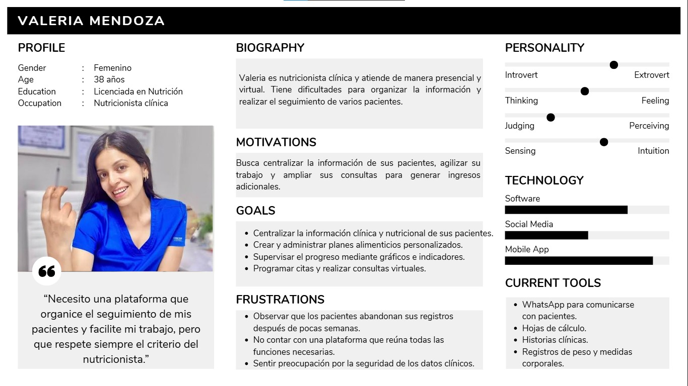
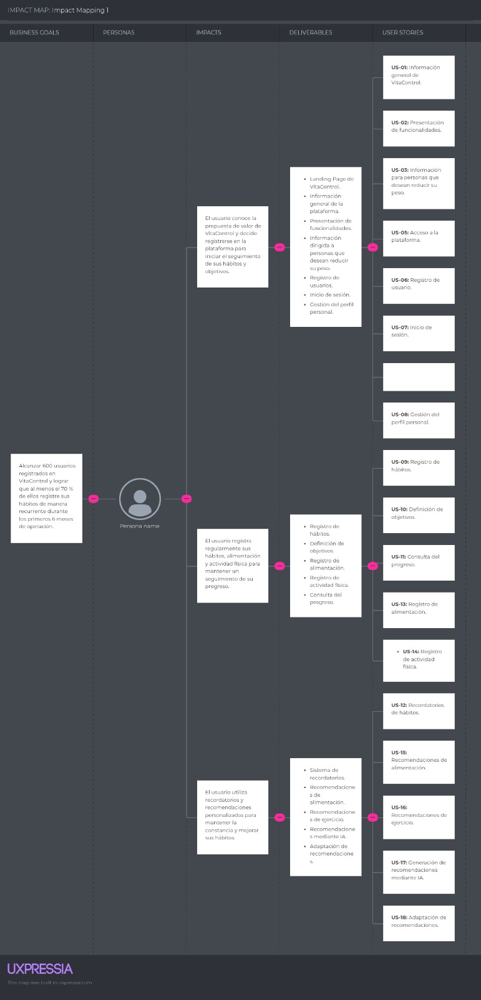
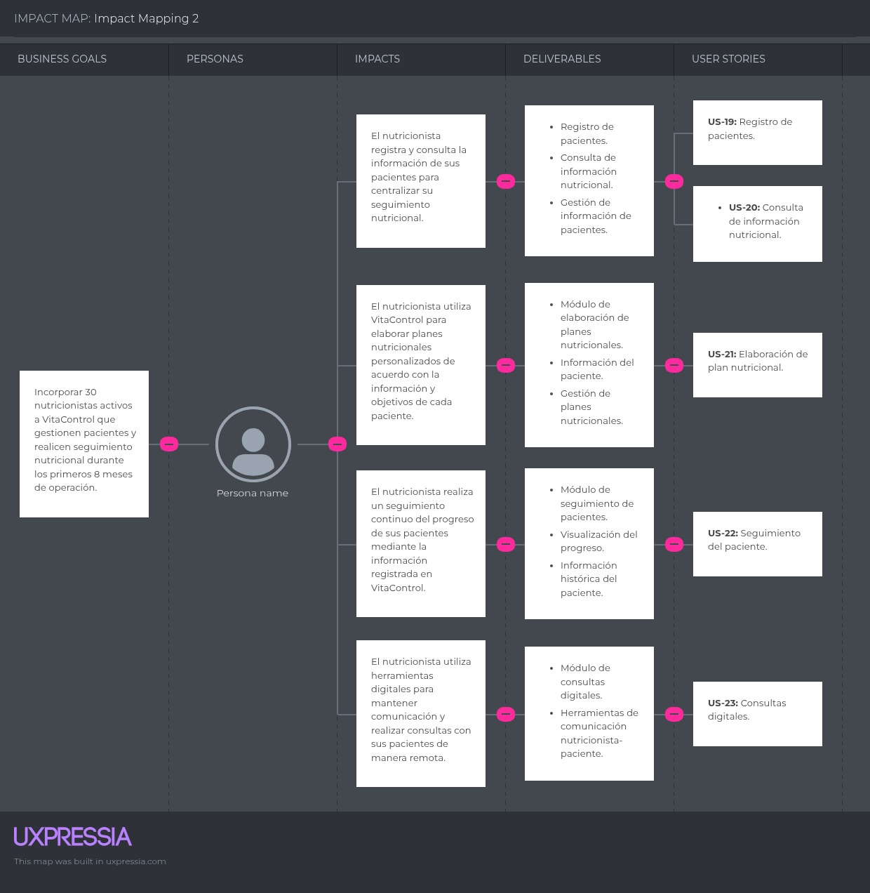

 

  

 
<h3 align="center"><strong>Universidad Peruana de Ciencias Aplicadas</strong></h3>
<h3 align="center"><strong>Carrera de Ingeniería de Software</strong></h3>

<h2 align="center"><strong>1ASI0730</strong></h2>
<h2 align="center"><strong>Aplicaciones Web</strong></h2>
<h3 align="center">NRC</h3>
<h2 align="center"><strong>16129</strong></h2>
<h2 align="center"><strong>Informe del Trabajo</strong></h2>
<h3 align="center">Docente</h3>
<h2 align="center"><strong>Sanchez Seña, Alberto Wilmer</strong></h2>
<h3 align="center">Equipo</h3>
<h2 align="center"><strong>NutriStartup</strong></h2>
<h3 align="center">Proyecto</h3>
<h2 align="center"><strong>NutriApp Integral</strong></h2>

<h2 align="center"><strong>Integrantes:</strong></h2>

  <table align="center">
    <thead>
      <tr>
        <th align="center" >Código</th>
        <th align="center" >Apellidos y Nombres</th>
      </tr>
    </thead>
    <tbody>
      <tr>
        <td align="center" >U202418250</td>
        <td align="center" >Poly Gabriel Alcantara Baldeon</td>
      </tr>
      <tr>
        <td align="center" >U202412447</td>
        <td align="center" >Waldo Alonso Portal Inga</td>
      </tr>
      <tr>
        <td align="center" >U202316162</td>
        <td align="center" >Giordano Sebastian Del Ángel Trejo Espejo</td>
      </tr>
      <tr>
        <td align="center" >U202416903</td>
        <td align="center" >Gabriel Alejandro Vilchez Vite</td>
      </tr>
      <tr>
        <td align="center" >U202312343</td>
        <td align="center" >Alejandro Franklin, Mendoza Vergara</td>
      </tr>
    </tbody>
  </table>

<h2 align="center"><strong>Período 202620</strong></h2>
<h2 align="center"><strong>Setiembre 2026</strong></h2>

## Registro de Versiones del Informe

| Versión | Fecha       | Autor                                     | Descripción de modificación                                                                                                                 |
|---------|-------------|-------------------------------------------|---------------------------------------------------------------------------------------------------------------------------------------------|
| 1.0     | 07/09/2026  | Waldo Alonso Portal Inga                  | Se añadió la descripción de la Startup, la sección perfiles de integrantes, el solution profile y los segmentos objetivo.                   |
| 2.0     | 11/09/2026  | Gabriel Alejandro Vilchez Vite            | Se actualizó la sección de los perfiles de los integrantes y se añadió los objetivos y restricciones que delimitan el alcance del proyecto. |
| 3.0     | 12/09/2026  | Gabriel Alejandro Vilchez Vite            | Se añadió la sección de competidores.                                                                                                       |
| 4.0     | 13/09/2026  | Waldo Alonso Portal Inga                  | Se añadió la sección de entrevistas, especificamente el diseño de las entrevistas.                                                          |
| 5.0     | 15/09/2026  | Poly Gabriel Alcantara Baldeon            | Se anadió la sección de estrategias y tácticas frente a competidores.                                                                       |
| 6.0     | 15/09/2026  | Gabriel Alejandro Vilchez Vite            | Se añadió la sección de registro de entrevistas.                                                                                            |
| 7.0     | 16/09/2026  | Giordano Sebastian Del Ángel Trejo Espejo | Se anadió la entrevista 1 del segmento 1.                                                                                                   |
| 8.0     | 17/09/2026  | Waldo Alonso Portal Inga                  | Se anadió la entrevista 2 del segmento 2.                                                                                                   |
| 9.0     | 17/09/2026  | Alejandro Franklin Mendoza Vergara        | Se anadió la entrevista 3 del segmento 2 y la sección de Ubiquitious Language.                                                              |
| 10.0    | 17/09/2026  | Gabriel Alejandro Vilchez Vite            | Se añadieron los User Stories.                                                                                                              |
| 11.0    | 18/09/2026  | Poly Gabriel Alcantara Baldeon            | Se anadió la entrevista 2 del segmento 1 y la sección de Análisis de entrevistas.                                                           |
| 12.0    | 19/09/2026  | Alejandro Franklin Mendoza Vergara        | Se añadió la sección de Software Configuration Management.                                                                                  |
| 13.0    | 19/09/2026  | Waldo Alonso Portal Inga                  | Se añadió los User Persona.                                                                                                                 |
| 14.0    | 19/09/2026  | Giordano Sebastian Del Ángel Trejo Espejo | Se añadió la sección de User Task Matrix, al mismo tiempo que añadio los User Persona al repositorio.                                       |
| 15.0    | 20/09/2026  | Gabriel Alejandro Vilchez Vite            | Se añadió el Impact Mapping y el Product Backlog.                                                                                           |

## Contenido

### Tabla de contenidos

- [Registro de Versiones del Informe](#registro-de-versiones-del-informe)
- [Project Report Collaboration Insights](#project-report-collaboration-insights)
- [Student Outcome](#student-outcome)
- [Capítulo I: Introducción](#capítulo-i-introducción)
    - [1.1. Startup Profile](#11-startup-profile)
        - [1.1.1. Descripción de la Startup](#111-descripción-de-la-startup)
        - [1.1.2. Perfiles de integrantes del equipo](#112-perfiles-de-integrantes-del-equipo)
    - [1.2. Solution Profile](#12-solution-profile)
        - [1.2.1. Antecedentes y problemática](#121-antecedentes-y-problemática)
        - [1.2.2. Lean UX Process](#122-lean-ux-process)
            - [1.2.2.1. Lean UX Problem Statements](#1221-lean-ux-problem-statements)
            - [1.2.2.2. Lean UX Assumptions](#1222-lean-ux-assumptions)
            - [1.2.2.3. Lean UX Hypothesis Statements](#1223-lean-ux-hypothesis-statements)
            - [1.2.2.4. Lean UX Canvas](#1224-lean-ux-canvas)
    - [1.3. Segmentos objetivo](#13-segmentos-objetivo)
- [Capítulo II: Requirements Elicitation & Analysis](#capítulo-ii-requirements-elicitation-and-analysis)
    - [2.1. Competidores](#21-competidores)
        - [2.1.1. Análisis competitivo](#211-análisis-competitivo)
        - [2.1.2. Estrategias y tácticas frente a competidores](#212-estrategias-y-tácticas-frente-a-competidores)
    - [2.2. Entrevistas](#22-entrevistas)
        - [2.2.1. Diseño de entrevistas](#221-diseño-de-entrevistas)
        - [2.2.2. Registro de entrevistas](#222-registro-de-entrevistas)
        - [2.2.3. Análisis de entrevistas](#223-análisis-de-entrevistas)
    - [2.3. Needfinding](#23-needfinding)
        - [2.3.1. User Personas](#231-user-personas)
        - [2.3.2. User Task Matrix](#232-user-task-matrix)
        - [2.3.3. User Journey Mapping](#233-user-journey-mapping)
        - [2.3.4. Empathy Mapping](#234-empathy-mapping)
    - [2.4. Big Picture EventStorming](#24-big-picture-eventstorming)
    - [2.5. Ubiquitous Language](#25-ubiquitous-language)
- [Capítulo III: Requirements Specification](#capítulo-iii-requirements-specification)
    - [3.1. User Stories](#31-user-stories)
    - [3.2. Impact Mapping](#32-impact-mapping)
    - [3.3. Product Backlog](#33-product-backlog)
- [Capítulo IV: Product Design](#capítulo-iv-product-design)
    - [4.1. Style Guidelines](#41-style-guidelines)
        - [4.1.1. General Style Guidelines](#411-general-style-guidelines)
        - [4.1.2. Web Style Guidelines](#412-web-style-guidelines)
    - [4.2. Information Architecture](#42-information-architecture)
        - [4.2.1. Organization Systems](#421-organization-systems)
        - [4.2.2. Labeling Systems](#422-labeling-systems)
        - [4.2.3. SEO Tags and Meta Tags](#423-seo-tags-and-meta-tags)
        - [4.2.4. Searching Systems](#424-searching-systems)
        - [4.2.5. Navigation Systems](#425-navigation-systems)
    - [4.3. Landing Page UI Design](#43-landing-page-ui-design)
        - [4.3.1. Landing Page Wireframe](#431-landing-page-wireframe)
        - [4.3.2. Landing Page Mock-up](#432-landing-page-mock-up)
    - [4.4. Web Applications UX/UI Design](#44-web-applications-uxui-design)
        - [4.4.1. Web Applications Wireframes](#441-web-applications-wireframes)
        - [4.4.2. Web Applications Wireflow Diagrams](#442-web-applications-wireflow-diagrams)
        - [4.4.3. Web Applications Mock-ups](#443-web-applications-mock-ups)
        - [4.4.4. Web Applications User Flow Diagrams](#444-web-applications-user-flow-diagrams)
    - [4.5. Web Applications Prototyping](#45-web-applications-prototyping)
    - [4.6. Domain-Driven Software Architecture](#46-domain-driven-software-architecture)
        - [4.6.1. Design-Level EventStorming](#461-design-level-eventstorming)
        - [4.6.2. Software Architecture Context Diagram](#462-software-architecture-context-diagram)
        - [4.6.3. Software Architecture Container Diagrams](#463-software-architecture-container-diagrams)
        - [4.6.4. Software Architecture Components Diagrams](#464-software-architecture-components-diagrams)
    - [4.7. Software Object-Oriented Design](#47-software-object-oriented-design)
        - [4.7.1. Class Diagrams](#471-class-diagrams)
    - [4.8. Database Design](#48-database-design)
        - [4.8.1. Database Diagrams](#481-database-diagrams)
- [Capítulo V: Product Implementation, Validation & Deployment](#capítulo-v-product-implementation-validation-and-deployment)
    - [5.1. Software Configuration Management](#51-software-configuration-management)
        - [5.1.1. Software Development Environment Configuration](#511-software-development-environment-configuration)
        - [5.1.2. Source Code Management](#512-source-code-management)
        - [5.1.3. Source Code Style Guide & Conventions](#513-source-code-style-guide-and-conventions)
        - [5.1.4. Software Deployment Configuration](#514-software-deployment-configuration)
    - [5.2. Landing Page, Services & Applications Implementation](#52-landing-page-services-and-applications-implementation)
    - [5.3. Validation Interviews](#53-validation-interviews)
        - [5.3.1. Diseño de Entrevistas](#531-diseño-de-entrevistas)
        - [5.3.2. Registro de Entrevistas](#532-registro-de-entrevistas)
        - [5.3.3. Evaluaciones según heurísticas](#533-evaluaciones-según-heurísticas)
    - [5.4. Video About-the-Product](#54-video-about-the-product)
- [Conclusiones](#conclusiones)
    - [Conclusiones y recomendaciones](#conclusiones-y-recomendaciones)
    - [Video About-the-Team](#video-about-the-team)
- [Bibliografía](#bibliografía)
- [Anexos](#anexos)

## Student Outcome

| Criterio Específico                                                                                      | Acciones Realizadas                                                                                                                                                                                                                                                                                                                                                                                                                                                                                                                                                                                                                                                                                                                                   | Conclusiones |
|----------------------------------------------------------------------------------------------------------|-------------------------------------------------------------------------------------------------------------------------------------------------------------------------------------------------------------------------------------------------------------------------------------------------------------------------------------------------------------------------------------------------------------------------------------------------------------------------------------------------------------------------------------------------------------------------------------------------------------------------------------------------------------------------------------------------------------------------------------------------------|--------------|
| **5.c1.** Trabaja en equipo para proporcionar liderazgo en forma conjunta                                | **AV1** - Waldo Alonso Portal Inga:  - Gabriel Alejandro Vilchez Vite: En el Av1, realice algunas tareas como definir los objetivos, las restricciones del proyecto y los competidores, al mismo tiempo que realice una entrevista y añadi los User Stories, el Impact Mapping y el Product Backlog. También ayude a organizar a mi equipo, al mismo tiempo que resolvia algunas dudas.  - Poly Gabriel Aleantara Baldeon:  - Alejandro Franklin Mendoza Vergara:Para este Av1 realice gran parte del capitulo 5, entrevistas y parte del capitulo 2. Gran parte de mi trabajo se vió respaldado por el equipo y a diversas ayudas que se brindó, además del liderazgo del team leader.  - Giordano Sebastian Del Ángel Trejo Espejo | **AV1**   |
| **5.c2.** Crea un entorno colaborativo e inclusivo, establece metas, planifica tareas y cumple objetivos | **AV1** - Waldo Alonso Portal Inga:  - Gabriel Alejandro Vilchez Vite: Durante el Av1, todos mis compañeros y yo calaboramos entre nosotros para lograr nuestros objetivos, Al mismo tiempo, logramos avanzar bastantes cosas gracias a nuestras metas establecidas.  - Poly Gabriel Aleantara Baldeon:  - Alejandro Franklin Mendoza Vergara:Para este Av1 realice gran parte del capitulo 5, entrevistas y parte del capitulo 2. Todo se logró gracias a las metas establecidas por el equipo para cada parte del trabajo, dónde nos ayudamos mutuamente y logré desarrollar nuevas habilidades relacionadas a las partes dirigidas hacia mi.  - Giordano Sebastian Del Ángel Trejo Espejo                                         | **AV1**   |

# Capítulo I: Introducción

## 1.1 Startup Profile

### 1.1.1 Descripción de la Startup

NutriStartup es una startup que se centra en el bienestar y el cuidado de la salud física y mental que tiene como objetivo ayudar a las personas en la construcción de hábitos saludables y mantenerlos en el tiempo a través de una plataforma digital personalizada. La solución que se ofrece consiste en un conjunto de herramientas de seguimiento, recomendaciones adaptativas y funcionalidades para la alimentación y la actividad física con la cual los usuarios podrán recibir acompañamiento a medida que se ajusta a los usuarios, a medida que sus objetivos, necesidades y características vayan evolucionando.

**Misión**

Ayudar a las personas a construir y mantener hábitos saludables; por medio de una solución digital inteligente, accesible y personalizada que contribuya a mejorar su calidad de vida.

**Visión**

Ser una solución referente en el cuidado de la salud física ,promoviendo estilos de vida saludables mediante tecnología innovadora y personalizada.

### 1.1.2 Perfiles de integrantes del equipo

| Nombre y descripción                                                                                                                                                                                                                                                                                                                                                                                                                                                                | Foto                                                                  |
|-------------------------------------------------------------------------------------------------------------------------------------------------------------------------------------------------------------------------------------------------------------------------------------------------------------------------------------------------------------------------------------------------------------------------------------------------------------------------------------|-----------------------------------------------------------------------|
|                                                                                                                                                                                                                                                                                                                                                                                                                                                                                     |                                                                       |
|                                                                                                                                                                                                                                                                                                                                                                                                                                                                                     |                                                                       |
| **Waldo Alonso Portal Inga - U202412447**   Soy estudiante de la carrera de Ingeniería de Software. Me considero una persona capaz, responsable y comprometida con mis objetivos académicos y personales. Siempre estoy motivado por los desafíos y busco siempre aportar valor en los equipos de trabajo en los que participo. Manejo la programación en C++ y Java, cuento con experiencia en la edición de video y/o imágenes                                                 |       |
|                                                                                                                                                                                                                                                                                                                                                                                                                                                                                     |                                                                       |
| **Gabriel Alejandro Vilchez Vite - U202416903**   Actualmente estudio la carrera de ingeniería de software y me considero una persona que no deja todos sus trabajos pendientes a última hora y que siempre trata de terminar todos sus trabajos a tiempo. Actualmente tengo conocimientos en matemáticas y en algunos lenguajes de programación como C++ y Matlab. Actualmente estoy estudiando Java.                                                                           |     |
|                                                                                                                                                                                                                                                                                                                                                                                                                                                                                     |                                                                       |
| **Alejandro Franklin Mendoza Vergara - U202312343**     Mi nombre es Alejandro Mendoza y soy estudiante de la carrera de Ingeniería de Software. Actualmente tengo experiencia en C++ y Python. Estoy interesado en seguir aprendiendo sobre diferentes lenguajes de programación y en la creación de distintas aplicaciones web y móviles, por lo que intento dar todo de mí para tener buenos resultados.                                                                      |  |
|                                                                                                                                                                                                                                                                                                                                                                                                                                                                                     |                                                                       |
| **Poly Gabriel Alcantara baldeon - u202418250**    Soy estudiante de la carrera de Ingeniería de Software. Me considero un profesional en formación, orientado al aprendizaje continuo y a la construcción de sistemas eficientes y seguros. Cuento con bases sólidas en lenguajes de programación como C#, Java y Python. Mi enfoque se centra en crear y proteger, buscando desarrollar soluciones funcionales con especial interés en la seguridad e integridad del código.  |     |                                                                      |                                                                       |
## 1.2 Solution Profile

### 1.2.1 Antecedentes y problemática.

El sobrepeso y la obesidad se han convertido en una problemática creciente de salud pública. Según la Organización Mundial de la Salud (OMS, 2024), 1 de cada 8 personas en el mundo vivía con obesidad en 2022, mientras que la obesidad en adultos se ha más que duplicado desde 1990. Este problema se debe a hábitos alimenticios inadecuados, sedentarismo y dificultades para mantener rutinas saludables de forma constante. Además, muchas personas abandonan dietas y programas de ejercicio por falta de motivación, seguimiento continuo o herramientas accesibles para monitorear su progreso.

Actualmente, existen aplicaciones orientadas al control del peso y hábitos saludables. Sin embargo, muchas de estas ofrecen soluciones poco adaptadas al contexto diario del usuario; por ello, surge la necesidad de una solución que brinde seguimiento personalizado para ayudar a las personas a mantener hábitos saludables y no abandonar sus metas.

**5”W” y 2”H”**

**Who: ¿Quiénes son los usuarios afectados?**
* Adultos y jóvenes que desean seguir rutinas de ejercicio y mantener su motivación para no abandonar sus metas de salud.
* Personas que buscan llevar una alimentación saludable, pero tienen dificultades para sostener hábitos debido a cambios de horario, trabajo o estudios.
* Personas con sobrepeso u obesidad que necesitan seguimiento continuo para controlar su progreso y mejorar su bienestar físico.

**What: ¿Qué problema se busca resolver?**
* Se busca resolver la dificultad de mantener hábitos saludables de manera constante.
* Se busca reducir el abandono frecuente de dietas y rutinas de ejercicio por falta de motivación y seguimiento.

**Where: ¿Dónde ocurre el problema?**
* En entornos donde los cambios de rutina, la falta de tiempo y los estilos de vida sedentarios dificultan mantener hábitos saludables.

**When: ¿Cuándo sucede o se muestra el problema?**
* Cuando las personas inician dietas o rutinas de ejercicio y no logran mantenerlas a largo plazo.
* Cuando suceden cambios en horarios o responsabilidades que dificultan continuar con hábitos saludables.

**Why: ¿Por qué es importante resolver el problema?**
* Es importante prevenir problemas debido al sobrepeso y promover mejores condiciones de salud física.
* Para ayudar a las personas a mantener hábitos saludables de forma continua y no solo temporal.

**How: ¿Cómo se enfrentará el problema?**
* Por medio de una aplicación móvil y página web que permite monitorear la alimentación, actividad física y evolución del progreso del usuario.
* Integración de IA adaptativa  para configurar rutinas y sugerencias alimenticias. Esta IA será entrenada con las respuestas del usuario sobre su edad, sexo, peso, altura, índice de masa corporal (calculada automáticamente), nivel de actividad física, meta deseada, en cuanto tiempo desea cumplir su meta, número de comidas diarias, alimentos frecuentes y presupuesto aproximado.

**How Much: ¿Cuánto es el costo de la solución?**
* La app ofrecerá una versión gratis que incluirá funcionalidades como monitoreo de hábitos, recomendaciones personalizadas por medio de la IA adaptativa.
* Se ofrecerá una versión premium con elementos complementarios, como funcionalidades ampliadas de personalización.
* Se podrá monetizarse por medio de alianzas con nutricionistas, gimnasios o servicios de bienestar integrados a la plataforma.

### 2.1.1. Análisis competitivo

En esta sección se describirán a nuestros competidores principales (MyFitnessPal, Lifesum y Noom) comparando la propuesta de nuestro startup NutriStartup. El objetivo es identificar fortalezas y debilidades para establecer nuestra ventaja competitiva en el mercado.

|                              | MyFitnessPal                                                                         | Lifesum                                                                                              | Noom                                                                                              | NutriApp Integral                                                                                                          |
|------------------------------|--------------------------------------------------------------------------------------|------------------------------------------------------------------------------------------------------|---------------------------------------------------------------------------------------------------|----------------------------------------------------------------------------------------------------------------------------|
| **Perfil**                   | Aplicación móvil enfocada en la nutrición, la salud y la actividad física.           | Aplicación móvil centrada en mejorar la alimentación y llevar un estilo de vida equilibrado.         | Aplicación móvil enfocada en la perdida de peso mediante un enfoque psicológico.                  | Plataforma digital (web y móvil) orientada al bienestar físico mediante IA y conexión con profesionales.                   |
| **Ventaja competitiva**      | Base de datos extensa para el conteo riguroso de calorías y macronutrientes.         | Diseño amigable enfocado en planes de alimentación y control rápido de carbohidratos e hidratación.  | Apoyo psicológico para promover un estilo de vida sostenible a largo plazo con lecciones breves.  | Recomendaciones con IA y un modelo de dos lados que conecta a usuarios con nutricionistas reales.                          |
| **Mercado objetivo**         | Personas que buscan un control meticuloso de sus macros, calorías y rutinas físicas. | Usuarios que desean perder peso mediante dietas personalizadas y un monitoreo visualmente atractivo. | Personas que buscan cambiar su comportamiento y mentalidad respecto a la comida para perder peso. | Personas de 18 a 50 años que buscan reducir peso y nutricionistas que desean gestionar pacientes y generar ingresos extra. |
| **Estrategias de marketing** | Alianzas con marcas de fitness y gran comunidad de usuarios activos.                 | Promoción de estilos de vida estéticos, dietas en tendencia y facilidad de usar.                     | Enfoque en el cambio de mentalidad.                                                               | Captación mediante alianzas con gimnasios y nutricionistas locales.                                                        |
| **Productos y servicios**    | Registro exhaustivo de comidas, metas personalizadas y seguimiento de actividad.     | Planes de alimentación personalizados, registro de hidratación y evaluación de progreso.             | Registro de consumo de alimentos combinado con lecciones psicológicas diarias.                    | Monitoreo de hábitos, IA adaptativa para recomendaciones y módulo de gestión para nutricionistas.                          |
| **Precios**                  | Versión gratuita y versión premium de 19.99 dólares.                                 | Versión gratuita.                                                                                    | Versión gratuita.                                                                                 | Modelo freemium: Versión gratuita con IA básica y versión premium con mejores funcionalidades.                             |
| **Canales de distribución**  | Móvil.                                                                               | Móvil.                                                                                               | Móvil.                                                                                            | Web y Móvil.                                                                                                               |

**Análisis SWOT (Fortalezas, Oportunidades, Debilidades, Amenazas)**

A continuación, se realiza el análisis de cada uno de los competidores analizados para identificar cómo nuestras fortalezas contribuirian a una ventaja competitiva importante:

**1. MyFitnessPal**
*   **Fortalezas:** Marca altamente reconocida con una funcionalidad de registro de comidas y macronutrientes muy detallada.
*   **Debilidades:** Su versión premium tiene un costo elevado que puede resultar inaccesible para algunos sectores.
*   **Oportunidades:** Expansión e integración con nuevos dispositivos de hardware (relojes inteligentes, básculas).
*   **Amenazas:** Surgimiento de nuevas aplicaciones gratuitas o más económicas que incluyan IA.

**2. Lifesum**
*   **Fortalezas:** Ofrece planes de alimentación personalizados y registro de hidratación en una aplicación totalmente gratuita.
*   **Debilidades:** Carece de la intervención directa de un profesional de la salud o inteligencia artificial que se adapte automáticamente al contexto del usuario.
*   **Oportunidades:** Crecimiento en la tendencia mundial de dietas específicas como el veganismo y keto.
*   **Amenazas:** Usuarios que abandonan la app al no ver resultados rápidos o por falta de motivación guiada.

**3. Noom**
*   **Fortalezas:** Su propuesta de valor es única al integrar un enfoque psicológico y lecciones diarias para el cambio de hábitos.
*   **Debilidades:** El requisito de leer lecciones diarias puede resultar tedioso para usuarios que buscan rapidez y practicidad.
*   **Oportunidades:** Aumento del interés en la salud mental vinculada a los trastornos alimenticios y el sobrepeso.
*   **Amenazas:** Otras aplicaciones de salud integrando módulos de mindfulness o psicología en sus plataformas.

**4. NutriApp Integral**
*   **Fortalezas:** Implementación de IA adaptativa para generar recomendaciones dinámicas y un ecosistema que conecta al usuario directamente con un nutricionista real.
*   **Debilidades:** Al ser una startup de reciente creación, carece inicialmente de una base de datos de usuarios activa y reconocimiento de marca en el mercado.
*   **Oportunidades:** Existe una necesidad desatendida en el segmento de profesionales nutricionistas que requieren herramientas digitales modernas para gestionar pacientes y ganar ingresos extra.
*   **Amenazas:** Los competidores con mayores recursos económicos podrían copiar rápidamente la funcionalidad de conexión profesional o el uso de IA.

### 2.1.2. Estrategias y tácticas frente a competidores

A partir del análisis competitivo realizado para NutriStartup (NutriApp Integral) y sus competidores directos (MyFitnessPal, Lifesum y Noom), se definen las estrategias y tácticas preliminares para afrontar las fortalezas de la competencia, aprovechar sus debilidades, y responder al contexto de oportunidades y amenazas del mercado.

#### Estrategias frente a las fortalezas y debilidades de cada competidor

| Competidor                        | Fortaleza clave del competidor                                                                 | Estrategia para afrontarla                                                                                                            | Debilidad clave del competidor                                                                                   | Táctica para aprovecharla                                                                                                            |
|-----------------------------------|------------------------------------------------------------------------------------------------|---------------------------------------------------------------------------------------------------------------------------------------|------------------------------------------------------------------------------------------------------------------|--------------------------------------------------------------------------------------------------------------------------------------|
| **NutriApp Integral (nosotros)**  | Personalización con IA y conexión directa entre usuario y nutricionista dentro de una sola app | Consolidar este diferenciador como eje central del producto y de la comunicación de marca                                             | Al ser una startup nueva, no cuenta con la base de usuarios ni el reconocimiento de marca de MyFitnessPal o Noom | Enfocar el crecimiento inicial en nichos específicos (universitarios, nutricionistas independientes) antes de competir a gran escala |
| **MyFitnessPal**                  | Base de datos de alimentos muy extensa y alto reconocimiento de marca                          | No competir en volumen de datos; enfocarse en una propuesta de valor distinta (acompañamiento profesional real, no solo autoregistro) | Su plan premium es costoso (USD 19.99/mes ≈ S/ 67) y no conecta al usuario con un nutricionista real             | Incluir seguimiento con nutricionista dentro del plan básico, sin el sobrecosto de MyFitnessPal Premium                              |
| **Lifesum**                       | App gratuita, con buena experiencia de usuario en planes de alimentación personalizados        | Igualar la gratuidad en el plan básico, pero diferenciarse por la calidad de la personalización                                       | No utiliza inteligencia artificial ni conecta con profesionales de salud                                         | Usar recomendaciones dinámicas con IA desde el primer uso, algo que Lifesum no ofrece                                                |
| **Noom**                          | Enfoque psicológico validado y contenido educativo diario que genera hábito                    | Incorporar micro-contenido educativo similar, pero adaptado al contexto nutricional/local                                             | No ofrece herramientas para que un nutricionista gestione varios pacientes a la vez                              | Captar al segmento de nutricionistas con un módulo de gestión de cartera de pacientes, vacío que Noom no cubre                       |
#### Estrategias frente a oportunidades y amenazas del entorno competitivo

| Tipo        | Descripción                                                                                                                | Estrategia de NutriApp Integral                                                                                                             |
|-------------|----------------------------------------------------------------------------------------------------------------------------|---------------------------------------------------------------------------------------------------------------------------------------------|
| Oportunidad | Ninguno de los tres competidores conecta al usuario final con un nutricionista real dentro de la misma app                 | Consolidar el modelo de dos lados (usuario + nutricionista) como el diferenciador principal frente a toda la competencia                    |
| Oportunidad | El mercado peruano/latinoamericano está poco atendido con contenido y soporte adaptados culturalmente                      | Priorizar idioma, precios en soles y hábitos alimenticios locales en el producto y la comunicación                                          |
| Amenaza     | Competidores grandes (MyFitnessPal, Noom) tienen los recursos para copiar rápido la función de conexión con nutricionistas | Acelerar el lanzamiento de esa función y generar alianzas tempranas con nutricionistas para fidelizarlos antes que la competencia reaccione |
| Amenaza     | Los usuarios están acostumbrados a alternativas gratuitas (Lifesum, Noom), lo que puede generar resistencia a pagar        | Ofrecer un plan freemium robusto que demuestre valor real antes de pedir la suscripción premium                                             |

## 2.2 Entrevistas

Con el propósito de comprender las necesidades, dificultades y expectativas de los segmentos objetivo de NutriApp Integral, se realizaron entrevistas cualitativas semiestructuradas. Estas entrevistas permitieron conocer las experiencias de las personas que desean reducir su peso y explorar las necesidades de los nutricionistas interesados en ampliar sus oportunidades profesionales mediante herramientas digitales.

La información obtenida será utilizada para validar los supuestos planteados durante el proceso Lean UX y orientar el diseño de las funcionalidades de la plataforma.

### 2.2.1. Diseño de entrevistas

Las entrevistas fueron diseñadas mediante preguntas abiertas para que los participantes pudieran explicar libremente sus experiencias, necesidades y expectativas. Cada entrevista tuvo una duración aproximada de cinco a ocho minutos y fue registrada en video con la autorización del participante.

#### Segmento 1: Personas que desean reducir su peso

El objetivo de estas preguntas es identificar las principales dificultades que enfrentan las personas al intentar bajar de peso, mantener una alimentación saludable y realizar actividad física de manera constante.

1. ¿Por qué te gustaría reducir o controlar tu peso?
2. ¿Qué dificultades has encontrado al intentar bajar de peso?
3. ¿Has seguido anteriormente alguna dieta o rutina de ejercicio? ¿Cómo fue tu experiencia?
4. ¿Cuál consideras que es tu mayor obstáculo para mantener una alimentación saludable?
5. ¿Qué situaciones hacen que abandones una dieta o rutina de ejercicio?
6. ¿Prefieres seguir un plan alimenticio estricto o uno flexible? ¿Por qué?
7. ¿Qué tipo de ejercicios consideras más cómodos o fáciles de realizar?
8. ¿Has utilizado alguna aplicación para controlar tu alimentación, peso o actividad física? ¿Qué te gustó y qué no?
9. ¿Consideras útil recibir recomendaciones personalizadas mediante inteligencia artificial? ¿Por qué?
10. ¿Qué tipo de apoyo o funcionalidad te motivaría a continuar con tus objetivos de salud?

#### Segmento 2: Nutricionistas que desean generar ingresos adicionales

El objetivo de estas preguntas es conocer cómo los nutricionistas gestionan actualmente la atención y el seguimiento de sus pacientes, así como su disposición para utilizar una plataforma digital que les permita ampliar sus servicios.

1. ¿Cómo realiza actualmente el seguimiento de la alimentación y el progreso de sus pacientes?
2. ¿Qué dificultades encuentra al atender y realizar el seguimiento de varios pacientes al mismo tiempo?
3. ¿Qué medios utiliza para comunicarse con sus pacientes fuera de las consultas?
4. ¿Con qué frecuencia sus pacientes abandonan el plan nutricional o dejan de registrar sus avances?
5. ¿Qué información considera indispensable para evaluar correctamente la evolución de un paciente?
6. ¿Ha utilizado alguna plataforma digital para administrar consultas o planes nutricionales? ¿Cómo fue su experiencia?
7. ¿Qué funciones debería incluir una plataforma para facilitar su trabajo como nutricionista?
8. ¿Estaría dispuesto a brindar consultas o seguimiento nutricional mediante una plataforma digital? ¿Por qué?
9. ¿Considera que una plataforma de este tipo podría ayudarle a atender a más pacientes y generar ingresos adicionales?
10. ¿Qué preocupaciones tendría antes de utilizar una plataforma para gestionar información de sus pacientes?

### 2.2.2. Registro de entrevistas

#### Segmento 1: Personas que desean reducir su peso

**Entrevista N° 1**

| **Nombres y apellidos** | **Edad** | **Distrito**  |
|-------------------------|----------|---------------|
| Ian Figueroa            | 21       | Pueblo Libre  |

| **Segmento**                       | **URL**                                                                                                                                                                                                                                                                                                                                                                      | **Inicio** | **Duración** |
|------------------------------------|------------------------------------------------------------------------------------------------------------------------------------------------------------------------------------------------------------------------------------------------------------------------------------------------------------------------------------------------------------------------------|------------|--------------|
| Persona que desea reducir su peso  | [Entrevista - 1er seg obj - Ian Figueroa.mp4](https://upcedupe-my.sharepoint.com/:v:/g/personal/u202316162_upc_edu_pe/IQDlDtCL_ei4Qb_YIGWJaQIlAeEuAvIgLHjxuIUhSrMjzTo?nav=eyJyZWZlcnJhbEluZm8iOnsicmVmZXJyYWxBcHAiOiJPbmVEcml2ZUZvckJ1c2luZXNzIiwicmVmZXJyYWxBcHBQbGF0Zm9ybSI6IldlYiIsInJlZmVycmFsTW9kZSI6InZpZXciLCJyZWZlcnJhbFZpZXciOiJNeUZpbGVzTGlua0NvcHkifX0&e=SSALMI)  | 00:00      | 6:44 min     |

**Resumen:** Ian Andre es un estudiante de Ingeniería Civil de 21 años con un estilo de vida actualmente sedentario, su actividad física se limita solo al trayecto entre la universidad y su casa debido a la alta carga de estudios. Sus principales motivaciones para controlar su peso son mejorar su salud general y su apariencia física y su mayor obstáculo que enfrenta es la falta de tiempo y los constantes cambios de horario en su rutina, lo que le dificulta organizarse y mantener la constancia en sus hábitos saludables. En el pasado ha utilizado aplicaciones de gimnasio con guías de entrenamiento, pero nunca ha utilizado herramientas para registrar o monitorear detalladamente su alimentación.

Ian prefiere utilizar solo su celular, por su comodidad, indicando que usaría la plataforma principalmente en momentos clave como antes de comer o antes de entrenar. Sobre sus canales de interacción, consume contenido relacionado con bienestar, ejercicios y salud de manera casual a través de TikTok e Instagram, y sin seguir a creadores de contenido o marcas. Para mantener la motivación necesitaría ver estadísticas claras sobre la tendencia de, por ejemplo, su pérdida de peso en la semana. Finalmente, considera muy importante que la aplicación ideal integre IA para generarle un plan semanal de dietas que sean fáciles de preparar y se ajusten a su presupuesto o gustos personales, esta simplificación de la planificación sería su principal razón para no abandonar la aplicación.

---
**Entrevista N° 2**

| **Nombres y apellidos** | **Edad** | **Distrito** |
|-------------------------|----------|--------------|
| Reyna Antezana          | 19       | Pueblo libre |

| **Segmento**                         | **URL**                                                                                                                                                                                                                                                                                                                                                                   | **Inicio** | **Duración** |
|--------------------------------------|---------------------------------------------------------------------------------------------------------------------------------------------------------------------------------------------------------------------------------------------------------------------------------------------------------------------------------------------------------------------------|------------|--------------|
| Persona que desea reducir su peso    | [Entrevista - 1er segmento objetivo - Reyna.mp4](https://upcedupe-my.sharepoint.com/:v:/g/personal/u202418250_upc_edu_pe/IQALxUMf-7IJSYYjTGmz_323AeVCUVKwezavhrncBzTUMp4?e=NxGDbP&nav=eyJyZWZlcnJhbEluZm8iOnsicmVmZXJyYWxBcHAiOiJTdHJlYW1XZWJBcHAiLCJyZWZlcnJhbFZpZXciOiJTaGFyZURpYWxvZy1MaW5rIiwicmVmZXJyYWxBcHBQbGF0Zm9ybSI6IldlYiIsInJlZmVycmFsTW9kZSI6InZpZXcifX0%3D) | 00:00      | 4:59 min     |

**Resumen:**
Reyna es una persona que busca reducir y controlar su peso principalmente para sentirse bien consigo misma y mejorar su condición física, enfrentando como principales obstáculos la falta de constancia, el control de antojos y la falta de organización que la llevan a abandonar las rutinas cuando se siente cansada, ocupada o desmotivada por no ver resultados rápidos. Aunque en el pasado ha intentado seguir dietas y ejercicios que le han resultado complicados de mantener a largo plazo, no ha utilizado aplicaciones previas de control, pero le gustaría probar una que le sirva de guía. Prefiere un plan alimenticio flexible que se adapte a su rutina y considera que los ejercicios más cómodos son las caminatas, correr o ir al gimnasio. Para mantenerse constante, valora positivamente que la herramienta incluya recordatorios, seguimiento de avances y recomendaciones personalizadas mediante inteligencia artificial, llegando a calificar como extraordinario que también pudiera conectarla directamente con un nutricionista.

---
#### Segmento 2: Nutricionistas que desean generar ingresos adicionales

**Entrevista N° 1**

| **Nombres y apellidos** | **Edad** | **Distrito** |
|-------------------------|----------|--------------|
| Cecilia Vallejos        | 45       | Ate          |

| **Segmento**   | **URL**                                                                                                                                                                                                                                                                                                                                                                    | **Inicio** | **Duración** |
|----------------|----------------------------------------------------------------------------------------------------------------------------------------------------------------------------------------------------------------------------------------------------------------------------------------------------------------------------------------------------------------------------|------------|--------------|
| Nutricionista  | [Entrevista - 2do seg obj - Cecilia Vallejos.mp4](https://upcedupe-my.sharepoint.com/:v:/g/personal/u202416903_upc_edu_pe/IQD6ZJJL4J-dRqyVz6pBUPMEAWjzu5v-e3l7sBAl0gjtXE0?e=DTUlho&nav=eyJyZWZlcnJhbEluZm8iOnsicmVmZXJyYWxBcHAiOiJTdHJlYW1XZWJBcHAiLCJyZWZlcnJhbFZpZXciOiJTaGFyZURpYWxvZy1MaW5rIiwicmVmZXJyYWxBcHBQbGF0Zm9ybSI6IldlYiIsInJlZmVycmFsTW9kZSI6InZpZXcifX0%3D) | 00:00      | 8:50 min     |

**Resumen:** Cecilia Vallejos, licenciada en Nutrición con especialización en nutrición clínica y maestría en servicios de alimentación, actualmente trabaja en el Hospital de Emergencias Grau - ESSALUD. Actualmente, ella está siguiendo a sus pacientes en función de la evaluación nutricional y la revisión de las historias clínicas, donde recoge información como diagnóstico, dieta, peso, talla, resultados de laboratorio. Sin embargo, Cecilia Vallejos señala que el limitado tiempo y la gran carga de pacientes hacen difícil poder seguir a cada uno y clasificar la información. Ha tenido una experiencia positiva con una plataforma que permitía calcular requerimientos calóricos y riesgos nutricionales, así que le gustaría contar con una herramienta que le permita centralizar la información clínica y elaborar correctamente los planes nutricionales. Estaría dispuesta a dar consultas mediante una plataforma digital porque entonces podría trabajar con más pacientes y generar ingresos extra, siempre que la tecnología no le reemplace el criterio profesional del nutricionista.

---

**Entrevista N.° 2**

| **Nombres y apellidos** | **Edad** | **Distrito**       |
|-------------------------|----------|--------------------|
| Mateo Salazar           | 25       | Santiago de Surco  |

| **Segmento**   | **URL**                                                                                                                            | **Inicio** | **Duración** |
|----------------|------------------------------------------------------------------------------------------------------------------------------------|------------|--------------|
| Nutricionista  | [Entrevista - 2do seg obj - Mateo Salazar.mp4](https://drive.google.com/file/d/17HxGaRUOs86-KTjkGCxS8PjZ58aepxbJ/view?usp=sharing) | 00:00      | 3:33 min     |

**Resumen:** Mateo Salazar es un nutricionista clínico de 25 años con dos años de experiencia atendiendo presencial y virtualmente a jóvenes y adultos. Actualmente, realiza el seguimiento de sus pacientes mediante WhatsApp, hojas de cálculo y registros de alimentación, peso y medidas corporales. Sin embargo, señala que la información suele quedar dispersa entre mensajes, fotografías y documentos, lo que dificulta organizar y supervisar a varios pacientes simultáneamente. También menciona que algunos pacientes dejan de registrar sus avances después de las primeras semanas. Aunque ha utilizado aplicaciones de alimentación y herramientas digitales, todavía no ha probado una plataforma que reúna todas las funciones que necesita. Por ello, le gustaría contar con una herramienta que permita crear planes personalizados, programar citas, enviar recordatorios, realizar videollamadas y visualizar el progreso mediante gráficos. Estaría dispuesto a brindar consultas y seguimiento por medio de una plataforma digital porque podría atender a pacientes de diferentes lugares, ampliar sus servicios y generar ingresos adicionales. No obstante, antes de utilizarla, evaluaría la seguridad de los datos, su facilidad de uso, el costo y el soporte técnico disponible.

---

**Entrevista N.° 3**

| **Nombres y apellidos** | **Edad** | **Distrito** |
|-------------------------|----------|--------------|
| Marisol López           | 59       | La Molina    |

| **Segmento**   | **URL**                                                                                                                                                                          | **Inicio** | **Duración** |
|----------------|----------------------------------------------------------------------------------------------------------------------------------------------------------------------------------|------------|--------------|
| Nutricionista  | [Entrevista - 2do seg obj - Marisol López.mp4](https://upcedupe-my.sharepoint.com/:v:/g/personal/u202312343_upc_edu_pe/IQBNWO9CkMKjRLvyVrbGqXy5AfvEvMAKSnSHuzDErCb30hE?e=GJzbUm) | 00:00      | 13:00 min    |

**Resumen:** Marisol López es una nutricionista clínica de 50 años con 32 años de experiencia atendiendo principalmente de forma presencial a adultos en la marina de guerra. Actualmente, realiza el seguimiento de sus pacientes mediante WhatsApp, donde les brinda información a seguir. Sin embargo, señala que el sistema de nutrición va muy lento debido a la gran cantidad de información que se posee y no se organiza adecuadamente. También menciona que algunos pacientes dejan de registrar sus avances después de las primeras semanas, principalmente por el abandono. No suele utilizar plataformas virtuales que la puedan apoyar debido a la poca experiencia que cuenta con las nueva tecnologías. Sin embargo, afirma que estas podrían ayudar al problema d ela lentitud del sistema, dada una organización correcta del estado de los paciente. Lo único que teme de la plataforma virtual es que se convierta en una herramienta de doble filo que promueva el sedentarismo y disminuya las citas presenciales debido a ello.

---
### 2.2.3 Análisis de entrevistas

## Análisis de entrevistas

### Segmento 1: Personas que desean reducir su peso 

- **Motivación principal:** ambos entrevistados buscan mejorar su salud y su apariencia física, con el propósito de fondo de sentirse mejor consigo mismos en su día a día.
- **Principal obstáculo:** ninguno atribuye su dificultad a la falta de información, sino a sostener la constancia en el tiempo. Ian lo relaciona con la falta de tiempo y los constantes cambios en su horario académico; Reyna con el control de antojos y la desmotivación que aparece cuando no ve resultados rápidos, lo que la lleva a abandonar rutinas ya iniciadas.
- **Uso previo de herramientas digitales:** ninguno ha usado antes una app dedicada específicamente a registrar o monitorear su alimentación de forma detallada. Ian sí tiene experiencia previa con apps de gimnasio orientadas a rutinas de entrenamiento.
- **Dispositivo de preferencia:** Ian prefiere usar exclusivamente el celular por comodidad, y planea usarlo en momentos clave como antes de comer o antes de entrenar.
- **Canales digitales de interacción:** Ian consume contenido de bienestar y ejercicio de forma casual en TikTok e Instagram, sin seguir marcas o creadores específicos, lo que sugiere un consumo pasivo más que una búsqueda activa de referentes.
- **Interés en inteligencia artificial:** ambos valoran positivamente que la plataforma incorpore IA  Ian espera un plan de dietas ajustado a su presupuesto y gustos personales, y Reyna espera recomendaciones personalizadas según su progreso.
- **Interés en conexión con un nutricionista:** Reyna califica como "extraordinario" poder conectarse directamente con un nutricionista desde la misma aplicación, lo que representa una posible ventaja diferencial frente a apps genéricas de conteo calórico.
- **Tipo de ejercicio preferido:** Reyna menciona sentirse más cómoda con caminatas, trote o gimnasio, actividades de bajo costo de entrada.
- **Factor de retención:** ambos coinciden en que lo que los mantendría usando la app y no abandonarla como en intentos anteriores es que les simplifique la toma de decisiones diarias, en lugar de exigirles esfuerzo adicional de planificación.

### Segmento 2: Nutricionistas que desean generar ingresos adicionales 

- **Perfil profesional:** las tres entrevistadas ejercen activamente la nutrición clínica, aunque desde contextos distintos: Cecilia en un entorno hospitalario, Mateo en consulta mixta presencial y virtual, y Marisol en atención institucional de larga trayectoria.
- **Herramienta de seguimiento actual:** Mateo y Marisol dependen principalmente de WhatsApp para dar seguimiento a sus pacientes, mientras que Cecilia trabaja con historias clínicas y evaluaciones nutricionales formales dentro del hospital.
- **Problema principal:** las tres coinciden en la dificultad para organizar y centralizar la información de sus pacientes conforme crece su carga de trabajo, ya sea por dispersión entre mensajes, fotos y documentos, o por lentitud en el manejo de la información dentro del sistema institucional.
- **Abandono de pacientes:** Mateo y Marisol notan que buena parte de sus pacientes deja de registrar sus avances después de las primeras semanas, un patrón de constancia similar al observado en el segmento anterior, pero visto ahora desde la perspectiva del profesional que intenta dar seguimiento.
- **Disposición a generar ingresos por plataforma digital:** las tres estarían dispuestas a dar consultas o seguimiento mediante una plataforma digital, principalmente para ampliar su alcance y generar ingresos adicionales a su actividad presencial.
- **Preocupación por el rol profesional:** Cecilia condiciona su interés a que la tecnología no reemplace el criterio profesional del nutricionista, posicionando la herramienta como apoyo y no como sustituto de su juicio clínico.
- **Criterios de adopción antes de usar la herramienta:** Mateo evaluaría primero la seguridad de los datos, la facilidad de uso, el costo y el soporte técnico disponible antes de decidirse a usar la plataforma.
- **Resistencia/temor tecnológico:** Marisol tiene poca experiencia con nuevas tecnologías y teme que una herramienta digital termine promoviendo el sedentarismo de sus pacientes al reducir las citas presenciales.
- **Funcionalidades deseadas:** en conjunto, el segmento apunta a una herramienta que centralice la información clínica y facilite la elaboración de planes nutricionales, con funciones adicionales como programación de citas, recordatorios, videollamadas y seguimiento gráfico del progreso.

## 2.3 Needfinding

### 2.3.1 User Personas

Persona que quiere reducir su peso

Nutricionista que busca generar ingresos extra

### 2.3.2 User Task Matrix

Este User Task Matrix explica las tareas principales que los User Personas realizan para intentar cumplir sus objetivos, sin evaluar la existencia de nuestra solución. Se han considerado a los arquetipos que representan nuestros dos segmentos objetivos: el User Persona 1 (Personas que quieran reducir su peso) y el User Persona 2 (Nutricionistas que buscan generar ingresos extra).

| Tareas Identificadas                                      | User Persona 1 (Persona buscando bajar de peso) |                 | User Persona 2 (Nutricionista) |                 |
|:----------------------------------------------------------|:-----------------------------------------------:|:---------------:|:------------------------------:|:---------------:|
|                                                           |                 **Frecuencia**                  | **Importancia** |         **Frecuencia**         | **Importancia** |
| Planificar comidas y alimentación diaria/semanal          |                 Frecuentemente                  |      Alta       |            Siempre             |      Alta       |
| Buscar información, rutinas o dietas en redes sociales    |                 Frecuentemente                  |      Media      |            Rara vez            |      Baja       |
| Registrar o calcular macronutrientes / calorías           |                     A veces                     |      Alta       |         Frecuentemente         |      Alta       |
| Realizar rutinas de actividad física                      |                     A veces                     |      Alta       |            Rara vez            |      Baja       |
| Evaluar progreso físico (medirse, pesarse)                |                 Frecuentemente                  |      Alta       |            Siempre             |      Alta       |
| Gestionar el historial clínico e información de pacientes |                    Rara vez                     |      Baja       |            Siempre             |      Alta       |
| Realizar seguimiento continuo de hábitos                  |                     A veces                     |      Alta       |         Frecuentemente         |      Alta       |
| Buscar formas de optimizar el tiempo diario               |                     Siempre                     |      Alta       |            Siempre             |      Alta       |

**Análisis de tareas:**
Las tareas con mayor frecuencia e importancia para ambos segmentos tratan sobre la planificación de la alimentación y sobre la evaluación del progreso físico. Sin embargo, las perspectivas son distintas, el User Persona 1 realiza estas tareas para su propio bienestar y con una frecuencia inconsistente debido a su falta de tiempo, y el User Persona 2 las realiza como parte de su servicio profesional para sus pacientes.
La diferencia está que para el nutricionista, organizar historiales y hacer seguimiento es una tarea diaria y de alta importancia que le consume mucho tiempo, mientras que para para una persona común es una tarea casi inexistente. Por otro lado, la búsqueda de motivación y rutinas en redes sociales es frecuente para el segmento 1, pero irrelevante para el segmento 2.

### 2.3.3 User Journey Mapping

### 2.3.4 Empathy Mapping

## 2.4 Big Picture EventStorming

## 2.5 Ubiquitious Language

### Introducción

El siguiente glosario define los términos clave del dominio de bienestar y cuidado de la salud de NutriApp Integral. Su propósito es establecer un lenguaje común entre todos los stakeholders, evitando ambigüedades y facilitando la comunicación durante el análisis, diseño y desarrollo de la plataforma.

### Glosario

**User (Usuario):** Persona que utiliza NutriApp Integral para mejorar sus hábitos y cuidar su bienestar físico y mental.

**Healthy Habit (Hábito Saludable):** Comportamiento positivo relacionado con la alimentación, actividad física o bienestar que el usuario busca incorporar y mantener en su vida diaria.

**Goal (Objetivo):** Resultado que el usuario desea alcanzar mediante el uso de NutriApp Integral, como mejorar su alimentación, aumentar su actividad física o controlar su peso.

**Personalized Plan (Plan Personalizado):** Conjunto de actividades, recomendaciones y metas adaptadas a las características, necesidades y objetivos de cada usuario.

**Profile (Perfil):** Conjunto de información personal y características del usuario utilizadas para personalizar su experiencia dentro de la plataforma.

**Physical Activity (Actividad Física):** Ejercicio o movimiento realizado por el usuario y registrado en NutriApp Integral.

**Food Intake (Consumo de Alimentos):** Registro de los alimentos y comidas consumidos por el usuario durante el día.

**Nutrition (Alimentación):** Información relacionada con los alimentos, comidas y hábitos alimenticios del usuario.

**Recommendation (Recomendación):** Sugerencia proporcionada por NutriApp Integral de acuerdo con los objetivos, hábitos, características y progreso del usuario.

**Progress (Progreso):** Evolución del usuario respecto al cumplimiento de sus objetivos y hábitos saludables.

**Tracking (Seguimiento):** Proceso de registrar y revisar las actividades, hábitos y avances del usuario a lo largo del tiempo.

**Habit Tracking (Seguimiento de Hábitos):** Registro del cumplimiento de los hábitos saludables establecidos por el usuario.

**Activity Record (Registro de Actividad):** Información almacenada sobre una actividad física realizada por el usuario, incluyendo datos relevantes como tipo, duración o frecuencia.

**Food Record (Registro de Alimentación):** Información registrada por el usuario sobre los alimentos o comidas que ha consumido.

**Reminder (Recordatorio):** Aviso generado por NutriApp Integral para ayudar al usuario a cumplir sus actividades, hábitos u objetivos establecidos.

**Notification (Notificación):** Mensaje enviado por la plataforma para informar al usuario sobre recordatorios, recomendaciones, avances o cambios relacionados con su actividad.

**Personalization (Personalización):** Proceso mediante el cual NutriApp Integral adapta sus recomendaciones y funcionalidades según las características, necesidades, objetivos y evolución del usuario.

**Adaptive Recommendation (Recomendación Adaptativa):** Recomendación que puede cambiar de acuerdo con el progreso, comportamiento y necesidades actuales del usuario.

**Streak (Racha):** Cantidad de días consecutivos en los que el usuario cumple con un hábito o actividad determinada.

**Consistency (Constancia):** Capacidad del usuario para mantener sus hábitos y actividades saludables de manera regular a lo largo del tiempo.

**Weight Tracking (Seguimiento de Peso):** Registro y seguimiento de los cambios en el peso del usuario durante un periodo determinado.

**Wellness (Bienestar):** Estado general relacionado con el cuidado y equilibrio de la salud física y mental del usuario.

**Healthy Lifestyle (Estilo de Vida Saludable):** Conjunto de hábitos y comportamientos relacionados con una alimentación adecuada, actividad física y cuidado del bienestar.

**Achievement (Logro):** Resultado obtenido por el usuario al cumplir una meta, mantener un hábito o alcanzar un determinado nivel de progreso.

**Dashboard (Panel de Control):** Espacio principal de NutriApp Integral donde el usuario puede visualizar sus objetivos, hábitos, actividades, progreso y recomendaciones.

**User Progress (Progreso del Usuario):** Información que permite visualizar los avances del usuario respecto a sus objetivos y hábitos saludables.

**Health Data (Datos de Salud):** Información proporcionada o registrada por el usuario relacionada con su bienestar, actividad física, alimentación y otros indicadores utilizados para personalizar la experiencia.

**Goal Completion (Cumplimiento del Objetivo):** Momento en el que el usuario alcanza el resultado establecido como meta dentro de NutriApp Integral.

**Habit Completion (Cumplimiento del Hábito):** Registro que indica que el usuario realizó una acción correspondiente a uno de sus hábitos establecidos.

**Motivation (Motivación):** Elementos y funcionalidades utilizadas por NutriApp Integral para incentivar al usuario a mantener la constancia y continuar con sus hábitos saludables.

**User Feedback (Retroalimentación del Usuario):** Información proporcionada por el usuario sobre sus hábitos, recomendaciones, experiencia o percepción de la plataforma, que puede utilizarse para mejorar la personalización.

**Evolution (Evolución):** Cambios que presentan los objetivos, necesidades, hábitos y progreso del usuario a lo largo del tiempo.

**NutriApp Integral Platform (Plataforma NutriApp Integral):** Sistema digital que integra las herramientas de seguimiento, alimentación, actividad física, recomendaciones y gestión de hábitos saludables.

**Personalized Experience (Experiencia Personalizada):** Experiencia que recibe cada usuario a partir de recomendaciones y funcionalidades adaptadas a sus características y necesidades.

**Healthy Habit Maintenance (Mantenimiento de Hábitos Saludables):** Proceso mediante el cual el usuario mantiene sus hábitos saludables de forma constante a lo largo del tiempo.

# Capítulo III: Requirements Specification

## 3.1 User Stories

Esta sección muestra los requisitos funcionales de NutriApp Integral a través de un agrupado de Epics y User Stories que poseen en cuenta las necesidades desde la investigación, las entrevistas y el análisis de los segmentos o los grupos identificados. Las historias contemplan las funcionalidades más importantes de la plataforma respecto a las personas que quieren reducir su peso y su salud, junto con la de los nutricionistas que desean gestionar pacientes y completar su recorrido profesional. También se incluyen User Stories del sitio web estático de la plataforma (Landing Page) enfocadas a los visitados de los segmentos o grupos identificados, junto con Technical Stories vinculadas al desarrollo del RESTful API. Todas las User Stories cuentan con una serie de criterios de aceptación construidas conforme a la estructura del Given-When-Then, dando la opción para validar que estamos cumpliendo los requisitos.

| **Epic / Story ID** | **Título**                                           | **Descripción**                                                                                                                                                                    | **Criterios de aceptación**                                                                                                                                                                                                                                                                                                                                                                                                                                                                                | **Relacionado con (Epic ID)** |
|---------------------|------------------------------------------------------|------------------------------------------------------------------------------------------------------------------------------------------------------------------------------------|------------------------------------------------------------------------------------------------------------------------------------------------------------------------------------------------------------------------------------------------------------------------------------------------------------------------------------------------------------------------------------------------------------------------------------------------------------------------------------------------------------|-------------------------------|
| **EP-01**           | **Landing Page**                                     | ---                                                                                                                                                                                | ---                                                                                                                                                                                                                                                                                                                                                                                                                                                                                                        | ---                           |
| US-01               | Información general de NutriApp Integral             | Como visitante, quiero conocer NutriApp Integral y su propuesta de valor para comprender cómo puede ayudarme a mejorar mis hábitos saludables.                                     | **Dado** que el visitante accede al sitio web, **cuando** consulta la información general de NutriApp Integral, **entonces** el visitante obtiene información sobre la propuesta de valor y los principales beneficios de la plataforma. **Dado** que el visitante pertenece a un segmento objetivo, **cuando** consulta la información dirigida a su necesidad, **entonces** encuentra contenido relacionado con sus objetivos.                                                                        | EP-01                         |
| US-02               | Presentación de funcionalidades                      | Como visitante, quiero conocer las principales funcionalidades de NutriApp Integral para identificar qué servicios ofrece la plataforma.                                           | **Dado** que el visitante consulta las funcionalidades, **cuando** revisa la información disponible, **entonces** identifica las funciones relacionadas con seguimiento de hábitos, recomendaciones personalizadas, actividad física y alimentación. **Dado** que el visitante consulta los servicios disponibles, **cuando** revisa la información, **entonces** puede diferenciar las funcionalidades generales de la plataforma.                                                                     | EP-01                         |
| US-03               | Información para personas que desean reducir su peso | Como visitante del segmento de personas que desean reducir su peso, quiero conocer cómo NutriApp Integral puede ayudarme a mantener hábitos saludables para evaluar su utilidad.   | **Dado** que el visitante pertenece al segmento de personas que desean reducir su peso, **cuando** consulta el contenido dirigido a su segmento, **entonces* obtiene información sobre seguimiento, recomendaciones y mantenimiento de hábitos. **Dado** que el visitante busca conocer los beneficios, **cuando** consulta la propuesta de NutriApp Integral, **entonces** identifica cómo la plataforma puede apoyar sus objetivos.                                                                   | EP-01                         |
| US-04               | Información para nutricionistas                      | Como visitante del segmento de nutricionistas, quiero conocer las herramientas que NutriApp Integral ofrece para gestionar pacientes para evaluar su utilidad profesional.         | **Dado** que el visitante pertenece al segmento de nutricionistas, **cuando** consulta el contenido dirigido a profesionales, **entonces** obtiene información sobre gestión de pacientes, seguimiento y elaboración de planes nutricionales. **Dado** que el visitante desea ampliar sus oportunidades profesionales, **cuando** consulta la propuesta para nutricionistas, **entonces** conoce cómo la plataforma puede apoyar la atención de pacientes.                                              | EP-01                         |
| US-05               | Acceso a la plataforma                               | Como visitante, quiero acceder a la plataforma desde el sitio web para utilizar sus funcionalidades.                                                                               | **Dado** que el visitante decide utilizar NutriApp Integral, **cuando** solicita acceder a la plataforma, **entonces** el sistema permite iniciar el proceso de acceso. **Dado** que el visitante no posee una cuenta, **cuando** solicita registrarse, *entonces** el sistema permite iniciar el proceso de creación de una cuenta.                                                                                                                                                                    | EP-01                         |
| **EP-02**           | **Gestión de usuarios y perfiles**                   | ---                                                                                                                                                                                | ---                                                                                                                                                                                                                                                                                                                                                                                                                                                                                                        | ---                           |
| US-06               | Registro de usuario                                  | Como visitante, quiero crear una cuenta proporcionando mi información personal para utilizar NutriApp Integral de manera personalizada.                                            | **Dado** que la persona proporciona información válida y completa, **cuando** solicita crear su cuenta, **entonces** el sistema registra al usuario. **Dado** que la información requerida es incompleta o inválida, **cuando** solicita crear su cuenta, **entonces** el sistema rechaza el registro e indica la información que debe corregirse.                                                                                                                                                      | EP-02                         |
| US-07               | Inicio de sesión                                     | Como usuario, quiero iniciar sesión para acceder a la información asociada con mi cuenta.                                                                                          | **Dado** que el usuario proporciona credenciales válidas, **cuando** solicita iniciar sesión, **entonces** el sistema autentica al usuario y permite acceder a la información asociada a su cuenta. **Dado** que las credenciales proporcionadas no son válidas, **cuando** el usuario solicita iniciar sesión, **entonces** el sistema rechaza la autenticación.                                                                                                                                       | EP-02                         |
| US-08               | Gestión del perfil personal                          | Como usuario, quiero registrar y actualizar mis características y preferencias para recibir recomendaciones adaptadas a mis necesidades.                                           | **Dado** que el usuario proporciona información personal válida, **cuando** registra su perfil, **entonces** el sistema almacena la información asociada a su cuenta. **Dado** que el usuario modifica alguna característica o preferencia, **cuando** actualiza su perfil, **entonces** el sistema almacena la información actualizada para utilizarla en futuras recomendaciones.                                                                                                                     | EP-02                         |
| **EP-03**           | **Seguimiento de hábitos y progreso**                | ---                                                                                                                                                                                | ---                                                                                                                                                                                                                                                                                                                                                                                                                                                                                                        | ---                           |
| US-09               | Registro de hábitos                                  | Como usuario, quiero registrar mis hábitos de alimentación y actividad física para realizar un seguimiento de mi comportamiento.                                                   | **Dado** que el usuario realiza una actividad relacionada con sus hábitos, **cuando** registra dicha actividad, **entonces** el sistema almacena el registro asociado a su cuenta. **Dado** que el usuario registra información válida, **cuando** consulta sus registros, **entonces** el sistema proporciona los datos correspondientes al periodo solicitado.                                                                                                                                        | EP-03                         |
| US-10               | Definición de objetivos                              | Como usuario, quiero establecer objetivos de alimentación y actividad física para orientar mi progreso.                                                                            | **Dado** que el usuario proporciona un objetivo válido, **cuando** registra el objetivo, **entonces** el sistema almacena el objetivo asociado a su cuenta. **Dado** que el usuario tiene un objetivo registrado, **cuando** modifica la información del objetivo, **entonces** el sistema actualiza los datos correspondientes.                                                                                                                                                                        | EP-03                         |
| US-11               | Consulta del progreso                                | Como usuario, quiero consultar mi progreso para conocer cómo evolucionan mis hábitos y objetivos.                                                                                  | **Dado** que el usuario posee registros de hábitos, **cuando** consulta su progreso, **entonces** el sistema proporciona información basada en los registros disponibles. **Dado** que el usuario no posee registros suficientes, **cuando** consulta su progreso, **entonces** el sistema informa que no existen datos suficientes para realizar el seguimiento.                                                                                                                                       | EP-03                         |
| US-12               | Recordatorios de hábitos                             | Como usuario, quiero recibir recordatorios relacionados con mis objetivos para mantener la constancia de mis hábitos saludables.                                                   | **Dado** que el usuario tiene un recordatorio activo, **cuando** llega el momento establecido, **entonces** el sistema genera el recordatorio correspondiente. **Dado** que el usuario desactiva un recordatorio, **cuando** llega el momento previamente establecido, **entonces** el sistema no genera dicho recordatorio.                                                                                                                                                                            | EP-03                         |
| **EP-04**           | **Alimentación y actividad física**                  | ---                                                                                                                                                                                | ---                                                                                                                                                                                                                                                                                                                                                                                                                                                                                                        | ---                           |
| US-13               | Registro de alimentación                             | Como usuario, quiero registrar los alimentos que consumo para realizar un seguimiento de mi alimentación.                                                                          | **Dado** que el usuario proporciona información válida sobre un alimento consumido, **cuando** registra su consumo, **entonces** el sistema almacena la información asociada a su cuenta. **Dado** que el usuario posee registros de alimentación, **cuando** consulta un periodo determinado, **entonces** el sistema proporciona los registros correspondientes.                                                                                                                                      | EP-04                         |
| US-14               | Registro de actividad física                         | Como usuario, quiero registrar mis actividades físicas para realizar un seguimiento de mis hábitos.                                                                                | **Dado** que el usuario proporciona información válida sobre una actividad física, **cuando** registra la actividad, **entonces** el sistema almacena el registro asociado a su cuenta. **Dado** que el usuario posee registros de actividad física, **cuando** consulta un periodo determinado, **entonces** el sistema proporciona las actividades registradas durante dicho periodo.                                                                                                                 | EP-04                         |
| US-15               | Recomendaciones de alimentación                      | Como usuario, quiero recibir recomendaciones alimenticias personalizadas para adaptar mi alimentación a mis objetivos y características.                                           | **Dado** que el usuario posee información personal y objetivos registrados, **cuando** solicita recomendaciones alimenticias, **entonces** el sistema genera recomendaciones considerando dicha información. **Dado** que el usuario actualiza información relevante para sus recomendaciones, **cuando** solicita nuevas recomendaciones, **entonces** el sistema considera la información actualizada.                                                                                                | EP-04                         |
| US-16               | Recomendaciones de ejercicio                         | Como usuario, quiero recibir recomendaciones de actividad física personalizadas para realizar actividades acordes con mis objetivos y características.                             | **Dado** que el usuario posee información personal y objetivos registrados, **cuando** solicita recomendaciones de actividad física, **entonces** el sistema genera recomendaciones considerando dicha información. **Dado** que el usuario modifica sus objetivos, **cuando** solicita nuevas recomendaciones de actividad física, **entonces** el sistema considera los objetivos actualizados.                                                                                                       | EP-04                         |
| **EP-05**           | **Inteligencia artificial adaptativa**               | ---                                                                                                                                                                                | ---                                                                                                                                                                                                                                                                                                                                                                                                                                                                                                        | ---                           |
| US-17               | Generación de recomendaciones mediante IA            | Como usuario, quiero recibir recomendaciones generadas mediante inteligencia artificial para obtener sugerencias adaptadas a mis necesidades.                                      | **Dado** que el usuario proporciona información suficiente para la personalización, **cuando** solicita una recomendación, **entonces** el sistema genera una recomendación utilizando los datos disponibles. **Dado** que el usuario no proporciona información suficiente, **cuando** solicita una recomendación personalizada, **entonces** el sistema solicita la información necesaria antes de generarla.                                                                                         | EP-05                         |
| US-18               | Adaptación de recomendaciones                        | Como usuario, quiero que las recomendaciones se adapten a mis cambios de hábitos y objetivos para recibir sugerencias acordes con mi situación actual.                             | **Dado** que el usuario modifica sus hábitos u objetivos, **cuando** el sistema genera nuevas recomendaciones, **entonces** las recomendaciones consideran la información actualizada. **Dado** que el usuario registra nuevos hábitos, **cuando** el sistema actualiza su información disponible, **entonces** utiliza los nuevos registros para futuras recomendaciones.                                                                                                                              | EP-05                         |
| **EP-06**           | **Gestión nutricional**                              | ---                                                                                                                                                                                | ---                                                                                                                                                                                                                                                                                                                                                                                                                                                                                                        | ---                           |
| US-19               | Registro de pacientes                                | Como nutricionista, quiero registrar y administrar la información de mis pacientes para realizar un seguimiento organizado.                                                        | **Dado** que el nutricionista proporciona información válida de un paciente, **cuando** registra al paciente, **entonces** el sistema almacena la información asociada al nutricionista. **Dado** que el paciente ya se encuentra registrado, **cuando** el nutricionista intenta registrarlo nuevamente, **entonces** el sistema evita la duplicación correspondiente.                                                                                                                                 | EP-06                         |
| US-20               | Consulta de información nutricional                  | Como nutricionista, quiero consultar la información nutricional de mis pacientes para evaluar su evolución.                                                                        | **Dado** que el nutricionista tiene acceso a un paciente registrado, **cuando** solicita su información nutricional, **entonces** el sistema proporciona los datos disponibles del paciente. **Dado** que el nutricionista no tiene autorización para consultar al paciente, **cuando** solicita su información, **entonces** el sistema rechaza la solicitud.                                                                                                                                          | EP-06                         |
| US-21               | Elaboración de plan nutricional                      | Como nutricionista, quiero elaborar planes nutricionales para proporcionar recomendaciones personalizadas a mis pacientes.                                                         | **Dado** que el nutricionista posee la información necesaria del paciente, **cuando** registra un plan nutricional válido, **entonces** el sistema almacena el plan asociado al paciente. **Dado** que el plan contiene información requerida incompleta, **cuando** el nutricionista intenta registrarlo, **entonces** el sistema rechaza el registro.                                                                                                                                                 | EP-06                         |
| US-22               | Seguimiento del paciente                             | Como nutricionista, quiero registrar y consultar la evolución de mis pacientes para realizar un seguimiento continuo.                                                              | **Dado** que el paciente posee registros de evolución, **cuando** el nutricionista consulta su seguimiento, **entonces** el sistema proporciona la información registrada. **Dado** que el nutricionista registra una nueva evolución, **cuando** confirma el registro, **entonces** el sistema almacena la nueva información asociada al paciente.                                                                                                                                                     | EP-06                         |
| US-23               | Consultas digitales                                  | Como nutricionista, quiero realizar consultas y seguimiento mediante la plataforma para ampliar mis oportunidades de atención profesional.                                         | **Dado** que el nutricionista y el paciente tienen una relación de atención válida, **cuando** se solicita una consulta digital, **entonces** el sistema registra la consulta correspondiente. **Dado** que la consulta finaliza, **cuando** el nutricionista registra la información correspondiente, **entonces** el sistema almacena el seguimiento realizado.                                                                                                                                       | EP-06                         |
| **EP-07**           | **Suscripciones y monetización**                     | ---                                                                                                                                                                                | ---                                                                                                                                                                                                                                                                                                                                                                                                                                                                                                        | ---                           |
| US-24               | Acceso al plan gratuito                              | Como usuario, quiero utilizar las funcionalidades disponibles del plan gratuito para conocer y utilizar NutriApp Integral sin contratar una suscripción.                           | **Dado** que el usuario posee una cuenta gratuita, **cuando** solicita una funcionalidad incluida en su plan, **entonces** el sistema permite utilizarla. **Dado** que el usuario solicita una funcionalidad exclusiva de un plan superior, **cuando** realiza la solicitud, **entonces** el sistema informa que dicha funcionalidad requiere el plan correspondiente.                                                                                                                                  | EP-07                         |
| US-25               | Suscripción premium                                  | Como usuario, quiero contratar un plan premium para acceder a funcionalidades ampliadas de personalización.                                                                        | **Dado** que el usuario selecciona un plan premium válido, **cuando** completa correctamente el proceso de suscripción, **entonces** el sistema registra el plan premium asociado a su cuenta. **Dado** que el proceso de suscripción no se completa correctamente, **cuando** se procesa la solicitud, **entonces** el sistema mantiene el plan anterior del usuario.                                                                                                                                  | EP-07                         |
| **EP-08**           | **RESTful API**                                      | ---                                                                                                                                                                                | ---                                                                                                                                                                                                                                                                                                                                                                                                                                                                                                        | ---                           |
| TS-01               | API de usuarios                                      | Como Developer, quiero disponer de operaciones REST para gestionar usuarios para permitir que las aplicaciones consuman la información de las cuentas.                             | **Dado** que se envía un request válido para registrar un usuario, **cuando** el API procesa la solicitud, **entonces** responde con el usuario creado y un código HTTP de creación exitosa. **Dado** que se solicita un usuario existente, **cuando** el API procesa el request, **entonces** responde con la información correspondiente. **Dado** que el usuario solicitado no existe, **cuando** se procesa el request, **entonces** el API responde indicando que el recurso no fue encontrado. | EP-08                         |
| TS-02               | API de perfiles                                      | Como Developer, quiero disponer de operaciones REST para consultar y actualizar perfiles para mantener sincronizada la información del usuario.                                    | **Dado** que se envía un request válido de actualización, **cuando** el API procesa la solicitud, **entonces** actualiza la información del perfil y responde con el recurso actualizado. **Dado** que el request contiene información inválida, **cuando** el API procesa la solicitud, **entonces** responde con un error de validación.                                                                                                                                                              | EP-08                         |
| TS-03               | API de hábitos                                       | Como Developer, quiero disponer de operaciones REST para registrar y consultar hábitos para permitir el seguimiento de los usuarios.                                               | **Dado** que se envía un request válido para registrar un hábito, **cuando** el API procesa la solicitud, **entonces** registra el hábito y responde con la información creada. **Dado** que se solicita el historial de hábitos de un usuario existente, **cuando** el API procesa el request, **entonces** responde con los registros correspondientes. **Dado** que el usuario no existe, **cuando** se procesa el request, **entonces** responde con un error de recurso no encontrado.          | EP-08                         |
| TS-04               | API de alimentación y actividad física               | Como Developer, quiero disponer de operaciones REST para gestionar registros de alimentación y actividad física para centralizar la información de seguimiento.                    | **Dado** que se envía un request válido de alimentación o actividad física, **cuando** el API procesa la solicitud, **entonces** registra la información y responde con el recurso creado. **Dado** que el request contiene datos inválidos, **cuando** se procesa, **entonces** responde con un error de validación.                                                                                                                                                                                   | EP-08                         |
| TS-05               | API de recomendaciones                               | Como Developer, quiero disponer de operaciones REST para solicitar y consultar recomendaciones para integrar las funcionalidades de personalización de NutriApp Integral.          | **Dado** que el usuario posee información suficiente, **cuando** la aplicación solicita una recomendación, **entonces** el API procesa la solicitud y devuelve la recomendación generada. **Dado** que no existe información suficiente para generar la recomendación, **cuando** se procesa el request, **entonces** el API responde indicando la información requerida.                                                                                                                               | EP-08                         |
| TS-06               | API de nutricionistas y pacientes                    | Como Developer, quiero disponer de operaciones REST para gestionar la relación entre nutricionistas y pacientes para permitir el seguimiento profesional.                          | **Dado** que se envía un request válido para registrar una relación entre nutricionista y paciente, **cuando** el API procesa la solicitud, **entonces** registra la relación. **Dado** que un nutricionista solicita información de un paciente sin autorización, **cuando** el API procesa el request, **entonces** rechaza la solicitud.                                                                                                                                                             | EP-08                         |
| TS-07               | API de planes nutricionales                          | Como Developer, quiero disponer de operaciones REST para gestionar planes nutricionales para permitir que los nutricionistas administren los planes de sus pacientes.              | **Dado** que se envía un request válido de creación de un plan nutricional, **cuando** el API procesa la solicitud, **entonces** registra el plan y devuelve el recurso creado. **Dado** que el paciente no pertenece a la cartera autorizada del nutricionista, **cuando** se solicita registrar o modificar su plan, **entonces** el API rechaza la operación.                                                                                                                                        | EP-08                         |
| TS-08               | API de suscripciones                                 | Como Developer, quiero disponer de operaciones REST para gestionar los planes de suscripción para controlar el acceso a las funcionalidades según el tipo de cuenta.               | **Dado** que se envía un request válido para cambiar el plan de un usuario, **cuando** el API procesa la solicitud, **entonces** actualiza la suscripción correspondiente. **Dado** que la solicitud de cambio de plan no es válida, **cuando** el API procesa el request, **entonces** responde con un error y mantiene la suscripción anterior.                                                                                                                                                       | EP-08                         |

## 3.2 Impact Mapping

En esta sección se presenta el Impact Mapping desarrollado para NutriApp Integral, con el propósito de relacionar los objetivos del negocio con los User Personas, los impactos esperados, los entregables y las User Stories asociadas. Este análisis permite identificar cómo las funcionalidades propuestas pueden contribuir al cumplimiento de los objetivos definidos para cada segmento de usuarios, manteniendo una relación clara entre las necesidades identificadas y los requisitos del producto.

## 3.3 Product Backlog

| # Orden | User Story ID | Título                                               | Descripción                                                                                                                                                    | Story Points |
|---------|---------------|------------------------------------------------------|----------------------------------------------------------------------------------------------------------------------------------------------------------------|--------------|
| 1       | US-06         | Registro de usuario                                  | Como visitante, quiero crear una cuenta proporcionando mi información personal para utilizar NutriApp Integral de manera personalizada.                        | 3            |
| 2       | US-07         | Inicio de sesión                                     | Como usuario, quiero iniciar sesión para acceder a la información asociada con mi cuenta.                                                                      | 2            |
| 3       | US-08         | Gestión del perfil personal                          | Como usuario, quiero registrar y actualizar mis características y preferencias para recibir recomendaciones adaptadas a mis necesidades.                       | 5            |
| 4       | US-10         | Definición de objetivos                              | Como usuario, quiero establecer objetivos de alimentación y actividad física para orientar mi progreso.                                                        | 3            |
| 5       | US-09         | Registro de hábitos                                  | Como usuario, quiero registrar mis hábitos de alimentación y actividad física para realizar un seguimiento de mi comportamiento.                               | 5            |
| 6       | US-13         | Registro de alimentación                             | Como usuario, quiero registrar los alimentos que consumo para realizar un seguimiento de mi alimentación.                                                      | 3            |
| 7       | US-14         | Registro de actividad física                         | Como usuario, quiero registrar mis actividades físicas para realizar un seguimiento de mis hábitos.                                                            | 3            |
| 8       | US-11         | Consulta del progreso                                | Como usuario, quiero consultar mi progreso para conocer cómo evolucionan mis hábitos y objetivos.                                                              | 5            |
| 9       | US-15         | Recomendaciones de alimentación                      | Como usuario, quiero recibir recomendaciones alimenticias personalizadas para adaptar mi alimentación a mis objetivos y características.                       | 5            |
| 10      | US-16         | Recomendaciones de ejercicio                         | Como usuario, quiero recibir recomendaciones de actividad física personalizadas para realizar actividades acordes con mis objetivos y características.         | 5            |
| 11      | US-17         | Generación de recomendaciones mediante IA            | Como usuario, quiero recibir recomendaciones generadas mediante inteligencia artificial para obtener sugerencias adaptadas a mis características y objetivos.  | 8            |
| 12      | US-18         | Adaptación de recomendaciones                        | Como usuario, quiero que las recomendaciones se adapten a los cambios de mi información y preferencias para recibir sugerencias cada vez más personalizadas.   | 8            |
| 13      | US-12         | Recordatorios de hábitos                             | Como usuario, quiero recibir recordatorios relacionados con mis objetivos para mantener la constancia de mis hábitos saludables.                               | 3            |
| 14      | US-24         | Acceso al plan gratuito                              | Como usuario, quiero acceder a las funcionalidades disponibles en el plan gratuito para utilizar NutriApp Integral sin contratar una suscripción.              | 2            |
| 15      | US-25         | Suscripción premium                                  | Como usuario, quiero suscribirme al plan premium para acceder a funcionalidades adicionales de personalización y seguimiento.                                  | 5            |
| 16      | US-01         | Información general de NutriApp Integral             | Como visitante, quiero conocer información general de NutriApp Integral para comprender el propósito y beneficio de la plataforma.                             | 2            |
| 17      | US-02         | Presentación de funcionalidades                      | Como visitante, quiero conocer las funcionalidades de NutriApp Integral para identificar cómo puede ayudarme a mejorar mis hábitos saludables.                 | 2            |
| 18      | US-03         | Información para personas que desean reducir su peso | Como visitante interesado en reducir mi peso, quiero conocer cómo NutriApp Integral puede ayudarme para evaluar si la plataforma responde a mis necesidades.   | 2            |
| 19      | US-04         | Información para nutricistas                         | Como nutricista, quiero conocer las funcionalidades dirigidas a profesionales para evaluar cómo NutriApp Integral puede apoyar mi trabajo.                     | 2            |
| 20      | US-05         | Acceso a la plataforma                               | Como visitante, quiero acceder a la plataforma desde la página principal para utilizar sus funcionalidades.                                                    | 2            |
| 21      | US-19         | Registro de pacientes                                | Como nutricista, quiero registrar pacientes para gestionar su información nutricional dentro de la plataforma.                                                 | 5            |
| 22      | US-20         | Consulta de información nutricional                  | Como nutricista, quiero consultar la información nutricional de mis pacientes para realizar un seguimiento adecuado.                                           | 5            |
| 23      | US-21         | Elaboración de plan nutricional                      | Como nutricista, quiero elaborar planes nutricionales para proporcionar recomendaciones acordes con las necesidades de mis pacientes.                          | 8            |
| 24      | US-22         | Seguimiento del paciente                             | Como nutricista, quiero realizar seguimiento de mis pacientes para conocer su evolución y ajustar sus planes nutricionales.                                    | 8            |
| 25      | US-23         | Consultas digitales                                  | Como nutricista, quiero realizar consultas mediante la plataforma para atender a mis pacientes de manera digital.                                              | 8            |
| 19      | US-04         | Información para nutricionistas                      | Como nutricionista, quiero conocer las funcionalidades dirigidas a profesionales para evaluar cómo NutriApp Integral puede apoyar mi trabajo.                  | 2            |
| 21      | US-19         | Registro de pacientes                                | Como nutricionista, quiero registrar pacientes para gestionar su información nutricional dentro de la plataforma.                                              | 5            |
| 22      | US-20         | Consulta de información nutricional                  | Como nutricionista, quiero consultar la información nutricional de mis pacientes para realizar un seguimiento adecuado.                                        | 5            |
| 23      | US-21         | Elaboración de plan nutricional                      | Como nutricionista, quiero elaborar planes nutricionales para proporcionar recomendaciones acordes con las necesidades de mis pacientes.                       | 8            |
| 24      | US-22         | Seguimiento del paciente                             | Como nutricionista, quiero realizar seguimiento de mis pacientes para conocer su evolución y ajustar sus planes nutricionales.                                 | 8            |
| 25      | US-23         | Consultas digitales                                  | Como nutricionista, quiero realizar consultas mediante la plataforma para atender a mis pacientes de manera digital.                                           | 8            |

## 4.1. Style Guidelines

En esta sección el equipo sienta las bases para contar con un repositorio central y organizado de uso común, que incluye assets, tipografías, paleta de colores y componentes visuales reutilizables. El objetivo es mantener una presentación consistente y enfocada en toda la experiencia digital de NutriApp Integral, tanto en el Landing Page como en la aplicación web.

### 4.1.1. General Style Guidelines

**Branding:** NutriApp Integral busca transmitir cercanía, motivación y confianza profesional al mismo tiempo, ya que atiende a dos segmentos con necesidades distintas: personas que buscan controlar su peso de forma sostenible, y nutricionistas que requieren una herramienta seria y confiable para su ejercicio profesional. El logo y la identidad visual se apoyan en formas orgánicas y redondeadas que evocan bienestar y salud, evitando un estilo clínico o frío que aleje al segmento de usuarios finales.

**Typography:** Se propone una tipografía sans-serif (por ejemplo, Poppins o Inter) para títulos y textos de interfaz, priorizando legibilidad en pantallas móviles y una sensación moderna y accesible. Se recomienda un máximo de dos familias tipográficas: una para títulos/encabezados (con mayor peso, semibold/bold) y otra para texto de cuerpo (regular), evitando sobrecargar la jerarquía visual.

**Colors:** La paleta principal se basa en tonos verdes (asociados a salud, bienestar y nutrición) como color primario, complementados con un color secundario cálido (naranja o amarillo suave) para llamadas a la acción y elementos de motivación/progreso. Se define además una escala de grises neutros para textos y fondos, y un color de alerta/error (rojo) reservado para validaciones y mensajes críticos.

**Spacing:** Se adopta un sistema de espaciado basado en múltiplos de 8px (8, 16, 24, 32...) para mantener consistencia entre componentes, tanto en el Landing Page como en la Web Application, facilitando además el diseño responsive.

**Tono de comunicación:** NutriApp Integral adopta un tono predominantemente **Entusiasta pero Sereno**, y **Casual pero Respetuoso**, buscando un punto intermedio entre ambos segmentos objetivo: cercano y motivador para el usuario final que busca bajar de peso, sin perder la seriedad y profesionalismo que espera el segmento de nutricionistas. Se evita el humor irreverente o un tono excesivamente formal/corporativo.

Como referencia de Design System se toma como base [Material Design 3 / el sistema de diseño que decidan usar], sobre el cual se realizan adaptaciones de color y tipografía acordes a la identidad de marca descrita.

### 4.1.2. Web Style Guidelines

En esta sección se explican e ilustran las decisiones sobre los estándares visuales y de interacción para las interfaces web responsivas de NutriApp Integral.

- **Grid system:** se define una grilla de 12 columnas para desktop, que colapsa a 4 columnas en dispositivos móviles, garantizando consistencia en el alineamiento de los elementos.
- **Breakpoints:** se establecen los puntos de quiebre estándar (móvil: hasta 480px, tablet: 481px–1024px, desktop: desde 1025px) para adaptar la disposición de contenido.
- **Componentes de interacción:** botones, campos de formulario, tarjetas de contenido y elementos de navegación siguen un estilo consistente en cuanto a bordes redondeados, sombras suaves y estados (hover, active, disabled), coherente con la identidad visual definida en el punto 4.1.1.
- **Accesibilidad:** se busca un contraste de color que cumpla al menos el nivel AA de WCAG, considerando que parte del segmento de nutricionistas (como Marisol López, con poca experiencia tecnológica) requiere una interfaz clara y fácil de leer.

## 4.2. Information Architecture

En esta sección el equipo plantea las decisiones y el sustento que dirigen la manera cómo se organizará el contenido en las experiencias web de NutriApp Integral, tanto en el Landing Page como en la Web Application. Estas propuestas están orientadas a que los visitantes y usuarios se adapten con facilidad a la funcionalidad del producto y puedan encontrar todo lo que necesiten sin esfuerzo, considerando las diferencias de necesidades entre el segmento de usuarios finales y el segmento de nutricionistas.

### 4.2.1. Organization Systems

Para el **Landing Page**, se aplica una organización **jerárquica (visual hierarchy)**, presentando primero la propuesta de valor general, seguida de funcionalidades, testimonios/beneficios y finalmente la llamada a la acción (registro), guiando al visitante de lo general a lo específico.

Para la **Web Application**, se combina organización **secuencial (step-by-step)** en flujos como el registro de comidas o la creación de un plan nutricional donde el usuario avanza por pasos definidos, con organización **matricial** en vistas como el dashboard de seguimiento, donde el usuario puede acceder a distintas secciones (progreso, plan alimenticio, citas con nutricionista) sin un orden obligatorio.

En cuanto a esquemas de categorización de contenido, se prioriza la organización **según audiencia (grupos de usuarios)**, separando claramente las vistas y funcionalidades destinadas al segmento de usuarios finales de las destinadas a nutricionistas. Dentro del contenido nutricional (por ejemplo, recetas o planes), se aplica adicionalmente una categorización **por tópicos** (tipo de dieta, objetivo, tiempo de preparación).

### 4.2.2. Labeling Systems

Se busca representar los datos con el mínimo número de palabras posible, evitando confusión para los visitantes y usuarios. Algunas etiquetas propuestas:

| Etiqueta                          | Asociación en la mente del usuario                 |
|-----------------------------------|----------------------------------------------------|
| "Mi Plan"                         | Plan nutricional personalizado asignado al usuario |
| "Progreso"                        | Historial y gráficos de avance (peso, medidas)     |
| "Nutricionista"                   | Sección de conexión/consulta con un profesional    |
| "Comidas"                         | Registro diario de alimentación                    |
| "Pacientes" (vista nutricionista) | Listado y seguimiento de pacientes asignados       |
| "Agenda" (vista nutricionista)    | Programación de citas y videollamadas              |

Cada etiqueta se mantiene consistente en toda la plataforma (mismo nombre en menú, encabezados y notificaciones), evitando sinónimos que generen confusión (por ejemplo, no alternar entre "Comidas" y "Alimentación").

### 4.2.3. SEO Tags and Meta Tags

| Página                      | Title                                                                         | Meta Description                                                                                                                      | Keywords                                                                           | Author               |
|-----------------------------|-------------------------------------------------------------------------------|---------------------------------------------------------------------------------------------------------------------------------------|------------------------------------------------------------------------------------|----------------------|
| Landing Page (home)         | NutriApp Integral \| Controla tu peso con planes nutricionales personalizados | Alcanza tus objetivos de salud con planes de alimentación personalizados por IA y conexión directa con nutricionistas certificados.   | Control de peso, nutrición personalizada, app de dietas, nutricionista online Perú | Equipo NutriStartup  |
| Página de registro/planes   | Planes NutriApp Integral \| Elige tu plan nutricional                         | Descubre los planes de NutriApp Integral adaptados a tus objetivos, presupuesto y estilo de vida.                                     | Planes nutricionales, dietas personalizadas, precios NutriApp Integral             | Equipo NutriStartup  |
| Página para nutricionistas  | NutriApp Integral para Nutricionistas \| Amplía tu consulta digital           | Centraliza la información de tus pacientes y ofrece consultas virtuales con NutriApp Integral.                                        | Plataforma para nutricionistas, consulta nutricional virtual, gestión de pacientes | Equipo NutriStartup  |

### 4.2.4. Searching Systems

Dado que el catálogo de contenido de NutriApp Integral (recetas, planes, artículos) puede crecer con el tiempo, se incluye un buscador dentro de la Web Application con las siguientes características:

- **Alcance:** búsqueda dentro de recetas/planes de alimentación y, en la vista de nutricionista, búsqueda de pacientes por nombre.
- **Filtros disponibles:** por tipo de dieta (baja en calorías, vegetariana, etc.), tiempo de preparación y nivel calórico, para el segmento de usuarios finales; por estado del paciente (activo/inactivo) y última fecha de seguimiento, para el segmento de nutricionistas.
- **Presentación de resultados:** los resultados se muestran en formato de tarjetas (cards) con imagen, nombre y datos clave (calorías, tiempo), permitiendo comparar opciones rápidamente sin necesidad de abrir cada elemento.
- **Estado vacío:** cuando una búsqueda no arroja resultados, se sugieren alternativas relacionadas en lugar de dejar la pantalla en blanco, evitando que el usuario se sienta perdido.

### 4.2.5. Navigation Systems

Se definen las siguientes técnicas de navegación para guiar a los usuarios a través del Landing Page y la Web Application:

- **Navegación global (Web Application):** un menú lateral (sidebar) persistente con acceso directo a las secciones principales (Mi Plan, Progreso, Comidas, Nutricionista/Pacientes según el rol), permitiendo moverse entre secciones sin perder el contexto.
- **Navegación por pestañas:** dentro de secciones con múltiples vistas relacionadas (por ejemplo, "Progreso" con pestañas de Peso, Medidas y Alimentación), para evitar sobrecargar el menú principal.
- **Breadcrumbs:** utilizados en flujos de varios pasos (como la creación de un plan nutricional) para que el usuario sepa en qué paso se encuentra y pueda regresar fácilmente.
- **Navegación del Landing Page:** un menú superior fijo (sticky header) con anclas hacia las secciones internas de la página (Beneficios, Planes, Testimonios, Contacto) y un botón de llamada a la acción siempre visible ("Empieza gratis").
- **Navegación diferenciada por rol:** al iniciar sesión, el sistema redirige automáticamente al usuario a la vista correspondiente a su rol (usuario final o nutricionista), evitando que cada segmento tenga que navegar manualmente hasta su sección relevante.

# NutriApp Integral

## 4.5. Web Applications Prototyping

### Introducción y criterios de diseño

El prototipo interactivo de **NutriApp Integral** representa la navegación y los principales flujos de la plataforma web. Su finalidad es validar la organización de las funciones, la facilidad de uso y la experiencia de los usuarios antes de comenzar el desarrollo del producto.

El prototipo considera los dos segmentos objetivos identificados durante la investigación: personas que desean reducir o controlar su peso y nutricionistas interesados en brindar consultas digitales, realizar seguimiento a sus pacientes y generar ingresos adicionales.

**Orientación según el tipo de usuario:** La interfaz presenta funciones diferentes según el rol seleccionado. Los pacientes pueden registrar sus avances, consultar su plan alimenticio, recibir recomendaciones y reservar citas. Por otro lado, los nutricionistas pueden gestionar pacientes, elaborar planes personalizados, revisar indicadores de progreso y administrar sus consultas.

**Consistencia en los patrones de interacción:** La plataforma mantiene una estructura visual uniforme en sus diferentes módulos. Se utiliza un menú lateral para acceder a las funciones principales, formularios para registrar información, ventanas modales para confirmar acciones importantes y notificaciones para comunicar resultados o recordar actividades pendientes.

**Personalización de la experiencia:** La información mostrada se adapta al perfil, objetivos y progreso de cada usuario. Los planes alimenticios y recomendaciones consideran datos como peso, talla, preferencias alimentarias, presupuesto, disponibilidad de tiempo y meta nutricional.

**Prevención de errores:** Las acciones que pueden modificar información importante, como eliminar un registro, cancelar una cita o cambiar un plan alimenticio, solicitan confirmación antes de ejecutarse. Los formularios también incluyen validaciones para evitar datos incompletos o valores incorrectos.

**Retroalimentación inmediata:** Después de registrar el peso, completar una actividad, reservar una consulta o actualizar un plan nutricional, la plataforma muestra un mensaje de confirmación. Los gráficos de progreso también se actualizan con la nueva información registrada.

**Accesibilidad y diseño responsive:** Los elementos interactivos presentan un tamaño adecuado, textos legibles y suficiente contraste. El prototipo está diseñado para adaptarse a computadoras, tablets y teléfonos móviles, debido a que los entrevistados señalaron que utilizarían principalmente el celular.

**Uso responsable de la inteligencia artificial:** Las recomendaciones generadas mediante inteligencia artificial funcionan como una herramienta de apoyo. Estas no reemplazan el diagnóstico, la evaluación ni el criterio profesional del nutricionista.

> **PENDIENTE: Imagen del prototipo general de NutriApp Integral.**  
> **Motivo:** Primero deben diseñarse y conectar en Figma las pantallas definitivas de ambos roles.  
> **Imagen requerida:** Vista general de todos los frames del prototipo, incluyendo las pantallas del paciente y del nutricionista.

### Flujos de interacción cubiertos por el prototipo

El prototipo de **NutriApp Integral** debe representar los siguientes flujos principales:

#### Flujo 1 — Registro y configuración del perfil nutricional

El usuario crea una cuenta, inicia sesión y completa su perfil con información como edad, peso, talla, objetivo, preferencias alimentarias, restricciones, disponibilidad de tiempo y presupuesto. Después de validar los datos, la plataforma crea su perfil nutricional y muestra el panel principal.

> **PENDIENTE: Imagen del flujo de registro y configuración del perfil.**  
> **Motivo:** Se requieren las pantallas conectadas en Figma para representar correctamente la navegación.  
> **Imagen requerida:** Creación de cuenta → inicio de sesión → registro de datos personales → selección de objetivo → registro de preferencias → confirmación del perfil → panel principal.

#### Flujo 2 — Generación y consulta del plan nutricional

El usuario solicita un plan alimenticio de acuerdo con su perfil y objetivo. El sistema procesa la información registrada y propone un plan semanal personalizado. El usuario puede revisar las comidas recomendadas, reemplazar opciones disponibles y solicitar la evaluación de un nutricionista.

> **PENDIENTE: Imagen del flujo de generación del plan nutricional.**  
> **Motivo:** Todavía debe elaborarse el prototipo visual de las recomendaciones y del plan semanal.  
> **Imagen requerida:** Panel principal → solicitud de plan → configuración de preferencias → plan generado → detalle de comidas → solicitud de revisión profesional.

#### Flujo 3 — Registro y visualización del progreso

El usuario registra periódicamente su peso, medidas corporales, alimentación y actividad física. La plataforma procesa los datos y presenta gráficos que permiten comparar los resultados con la meta establecida.

> **PENDIENTE: Imagen del flujo de seguimiento del progreso.**  
> **Motivo:** Se necesitan las pantallas finales de registro de avances y visualización de estadísticas.  
> **Imagen requerida:** Panel principal → registrar progreso → ingresar peso y medidas → guardar registro → visualizar gráficos e indicadores.

#### Flujo 4 — Reserva y atención de una consulta nutricional

El usuario revisa los perfiles de los nutricionistas disponibles, selecciona uno y consulta sus horarios. Luego reserva una cita y recibe una confirmación. El nutricionista puede revisar la solicitud, acceder a la información autorizada del paciente y realizar el seguimiento correspondiente.

> **PENDIENTE: Imagen del flujo de reserva de consulta.**  
> **Motivo:** Todavía deben conectarse las pantallas correspondientes al paciente y al nutricionista.  
> **Imagen requerida:** Lista de nutricionistas → perfil profesional → horarios disponibles → confirmación de reserva → agenda del nutricionista → atención o seguimiento.

#### Flujo 5 — Gestión y seguimiento de pacientes

El nutricionista visualiza a sus pacientes, consulta sus registros, revisa su evolución y crea o modifica sus planes nutricionales. También puede enviar recomendaciones y recordatorios para mejorar la constancia del paciente.

> **PENDIENTE: Imagen del flujo de gestión de pacientes.**  
> **Motivo:** Se requiere diseñar el panel profesional y sus módulos de seguimiento.  
> **Imagen requerida:** Panel del nutricionista → lista de pacientes → perfil del paciente → historial de progreso → creación o actualización del plan → envío de recomendación.

## 4.6. Domain-Driven Software Architecture

La arquitectura de **NutriApp Integral** se diseña siguiendo los principios de **Domain-Driven Design (DDD)**. Este enfoque permite organizar el sistema según los procesos y reglas principales del negocio, estableciendo límites claros entre las funcionalidades destinadas a los pacientes y aquellas utilizadas por los nutricionistas.

A partir del análisis de las entrevistas, las necesidades de los usuarios y las funcionalidades planteadas, se identificaron los siguientes dominios:

1. **Identity and Access Management:** gestiona el registro, autenticación, recuperación de contraseña y permisos según el rol del usuario.
2. **User Profile Management:** administra los datos personales, objetivos, preferencias y restricciones del paciente, además de la información profesional del nutricionista.
3. **Nutrition Plan Management:** permite crear, generar, revisar y actualizar planes nutricionales personalizados.
4. **Progress Monitoring:** gestiona el registro y la visualización del peso, medidas corporales, alimentación, actividad física y cumplimiento de objetivos.
5. **Appointment Management:** administra la disponibilidad de los nutricionistas, la reserva de consultas y el seguimiento posterior de los pacientes.

Esta separación facilita la evolución independiente de cada dominio, reduce el acoplamiento entre los componentes y mantiene un lenguaje común entre los integrantes del equipo.

### 4.6.1. Design-Level EventStorming

El Design-Level EventStorming de **NutriApp Integral** permite representar los comandos, eventos, actores, reglas y conceptos que participan en sus principales procesos. Mediante este análisis se identifican las responsabilidades de cada dominio y la comunicación necesaria entre ellos.

#### 1. Identity and Access Management

**Gestión de identidad y acceso**

**Propósito:** Gestionar el registro, autenticación, recuperación de contraseña, sesiones y permisos de los pacientes, nutricionistas y administradores.

**Clasificación estratégica:** Dominio genérico de autenticación y seguridad.

**Roles del dominio:** Paciente, nutricionista, administrador y servicio de autenticación.

**Comunicación entrante:**

- Solicitud de registro de usuario.
- Comando autenticar usuario.
- Comando cerrar sesión.
- Solicitud restablecer contraseña.
- Comando asignar rol.

**Comunicación saliente:**

- Evento usuario registrado.
- Evento usuario autenticado.
- Evento sesión cerrada.
- Evento contraseña restablecida.
- Evento rol asignado.

**Lenguaje ubicuo:** Cuenta de usuario, credenciales, sesión, rol, permiso, token de autenticación y estado de cuenta.

**Decisiones de negocio:**

- Cada correo electrónico solo puede estar asociado con una cuenta.
- El acceso a las funciones depende del rol asignado.
- Las contraseñas deben cumplir los requisitos mínimos de seguridad.
- Los nutricionistas deben completar la información profesional requerida.

**Supuestos:** Los usuarios cuentan con un correo electrónico válido y acceso a internet para registrarse y autenticarse.

**Métricas de verificación:** Porcentaje de registros completados, porcentaje de accesos exitosos, tiempo promedio de autenticación, intentos fallidos y solicitudes de recuperación de contraseña.

**Preguntas abiertas:**

- ¿Se verificará obligatoriamente el correo electrónico?
- ¿Se utilizará autenticación mediante Google?
- ¿Cómo se validarán las credenciales profesionales de los nutricionistas?

> **PENDIENTE: Imagen del EventStorming de Identity and Access Management.**  
> **Motivo:** La información anterior debe organizarse visualmente en Miro, FigJam o Figma.  
> **Imagen requerida:** Propósito, clasificación, roles, comunicación entrante y saliente, lenguaje ubicuo, decisiones, supuestos, métricas y preguntas abiertas.

#### 2. User Profile Management

**Gestión de perfiles de usuario**

**Propósito:** Gestionar los datos personales, objetivos, preferencias y restricciones de los pacientes, así como la información profesional y disponibilidad de los nutricionistas.

**Clasificación estratégica:** Dominio de soporte.

**Roles del dominio:** Paciente, nutricionista, administrador y gestor de perfiles.

**Comunicación entrante:**

- Comando crear perfil.
- Comando actualizar información personal.
- Comando registrar objetivo nutricional.
- Comando registrar preferencias alimentarias.
- Comando registrar restricción alimentaria.
- Comando actualizar perfil profesional.

**Comunicación saliente:**

- Evento perfil creado.
- Evento información personal actualizada.
- Evento objetivo nutricional registrado.
- Evento preferencias actualizadas.
- Evento restricción registrada.
- Evento perfil profesional actualizado.

**Lenguaje ubicuo:** Perfil de paciente, perfil profesional, objetivo nutricional, preferencia alimentaria, restricción alimentaria, presupuesto, disponibilidad y datos antropométricos.

**Decisiones de negocio:**

- El paciente debe completar los datos mínimos antes de solicitar un plan.
- Las restricciones alimentarias deben considerarse en todas las recomendaciones.
- El perfil del nutricionista debe mostrar su especialidad y experiencia.
- Los datos sensibles solo pueden consultarse con autorización.

**Supuestos:** Los usuarios proporcionan información verdadera y actualizan sus datos cuando se produce algún cambio relevante.

**Métricas de verificación:** Porcentaje de perfiles completados, tiempo promedio para completar el perfil, perfiles actualizados y porcentaje de nutricionistas con información verificada.

**Preguntas abiertas:**

- ¿Qué datos serán obligatorios para crear un perfil?
- ¿Los pacientes podrán ocultar determinados datos?
- ¿Cada cuánto tiempo se solicitará actualizar el peso y las medidas?

> **PENDIENTE: Imagen del EventStorming de User Profile Management.**  
> **Motivo:** Debe construirse la representación visual del dominio a partir de los elementos definidos.  
> **Imagen requerida:** Comandos, eventos, conceptos y decisiones relacionados con los perfiles de pacientes y nutricionistas.

#### 3. Nutrition Plan Management

**Gestión de planes nutricionales**

**Propósito:** Crear, generar, revisar y actualizar planes alimenticios personalizados según los objetivos, preferencias y restricciones del paciente.

**Clasificación estratégica:** Dominio núcleo.

**Roles del dominio:** Paciente, nutricionista, asistente de recomendaciones y gestor de planes nutricionales.

**Comunicación entrante:**

- Comando solicitar plan nutricional.
- Comando generar propuesta de plan.
- Comando crear plan personalizado.
- Comando modificar plan.
- Comando aprobar plan.
- Comando reemplazar alimento.

**Comunicación saliente:**

- Evento plan solicitado.
- Evento propuesta generada.
- Evento plan nutricional creado.
- Evento plan actualizado.
- Evento plan aprobado.
- Evento alimento reemplazado.

**Lenguaje ubicuo:** Plan nutricional, plan semanal, comida, alimento, porción, restricción alimentaria, preferencia, objetivo nutricional, recomendación y sustitución de alimento.

**Decisiones de negocio:**

- Ningún plan puede incluir alimentos registrados como restringidos.
- Las recomendaciones deben considerar el objetivo y las preferencias del paciente.
- Los planes creados por inteligencia artificial son propuestas sujetas a revisión.
- El nutricionista conserva la decisión final sobre el tratamiento nutricional.
- Los cambios realizados en un plan deben conservarse en el historial.

**Supuestos:** El paciente ha completado previamente su perfil nutricional y sus datos se encuentran actualizados.

**Métricas de verificación:** Cantidad de planes generados, porcentaje de planes revisados, modificaciones por plan, cumplimiento semanal y satisfacción con las recomendaciones.

**Preguntas abiertas:**

- ¿Qué modelo de inteligencia artificial se utilizará?
- ¿Qué información nutricional será necesaria para generar los planes?
- ¿Cómo se advertirá al usuario que una recomendación no reemplaza una consulta profesional?

> **PENDIENTE: Imagen del EventStorming de Nutrition Plan Management.**  
> **Motivo:** Los comandos, eventos y reglas deben trasladarse a un tablero visual.  
> **Imagen requerida:** Proceso desde la solicitud del plan hasta su generación, revisión, aprobación y actualización.

#### 4. Progress Monitoring

**Monitoreo del progreso**

**Propósito:** Registrar y analizar la evolución del paciente mediante datos relacionados con su peso, medidas corporales, alimentación, actividad física y cumplimiento del plan.

**Clasificación estratégica:** Dominio núcleo.

**Roles del dominio:** Paciente, nutricionista, servicio de seguimiento y sistema de notificaciones.

**Comunicación entrante:**

- Comando registrar peso.
- Comando registrar medidas corporales.
- Comando registrar actividad física.
- Comando registrar cumplimiento del plan.
- Comando consultar progreso.
- Comando enviar recordatorio.

**Comunicación saliente:**

- Evento peso registrado.
- Evento medidas actualizadas.
- Evento actividad registrada.
- Evento cumplimiento actualizado.
- Evento progreso calculado.
- Evento recordatorio enviado.
- Evento meta alcanzada.

**Lenguaje ubicuo:** Registro de progreso, peso, medida corporal, actividad física, meta, indicador de progreso, cumplimiento, historial y recordatorio.

**Decisiones de negocio:**

- Los registros deben almacenarse con fecha y hora.
- Los datos históricos no deben reemplazarse al ingresar una nueva medición.
- Los gráficos deben mostrar la evolución respecto de la meta.
- Los recordatorios deben respetar la configuración del usuario.
- El nutricionista solo puede visualizar pacientes vinculados con su atención.

**Supuestos:** El usuario registra sus datos periódicamente y utiliza el mismo criterio de medición para mantener la consistencia del seguimiento.

**Métricas de verificación:** Frecuencia de registro de avances, usuarios activos semanalmente, cumplimiento promedio del plan, metas alcanzadas y tasa de abandono de registros.

**Preguntas abiertas:**

- ¿Con qué frecuencia se enviarán los recordatorios?
- ¿Se permitirá sincronizar datos con dispositivos inteligentes?
- ¿Qué indicadores serán visibles para el paciente y para el nutricionista?

> **PENDIENTE: Imagen del EventStorming de Progress Monitoring.**  
> **Motivo:** Falta elaborar el tablero visual correspondiente al seguimiento.  
> **Imagen requerida:** Registro de datos, cálculo del progreso, generación de gráficos, recordatorios y logro de metas.

#### 5. Appointment Management

**Gestión de citas y consultas nutricionales**

**Propósito:** Administrar la disponibilidad de los nutricionistas, la reserva de consultas, la comunicación con los pacientes y el seguimiento posterior a cada atención.

**Clasificación estratégica:** Dominio núcleo.

**Roles del dominio:** Paciente, nutricionista, administrador de agenda y servicio de notificaciones.

**Comunicación entrante:**

- Comando publicar disponibilidad.
- Comando consultar horarios.
- Comando reservar cita.
- Comando confirmar cita.
- Comando reprogramar cita.
- Comando cancelar cita.
- Comando registrar atención.

**Comunicación saliente:**

- Evento disponibilidad publicada.
- Evento cita reservada.
- Evento cita confirmada.
- Evento cita reprogramada.
- Evento cita cancelada.
- Evento consulta realizada.
- Evento seguimiento programado.

**Lenguaje ubicuo:** Agenda, disponibilidad, horario, cita, consulta virtual, estado de cita, reprogramación, cancelación, seguimiento y nutricionista asignado.

**Decisiones de negocio:**

- Una cita solo puede reservarse dentro de un horario disponible.
- El mismo horario no puede asignarse a dos pacientes.
- Las cancelaciones y reprogramaciones deben notificarse a ambas partes.
- El paciente debe autorizar el acceso del nutricionista a su información.
- Las consultas realizadas deben registrarse en el historial.

**Supuestos:** El nutricionista mantiene actualizada su disponibilidad y ambas partes cuentan con acceso a internet para realizar una consulta virtual.

**Métricas de verificación:** Número de citas reservadas, porcentaje de citas completadas, tasa de cancelaciones, tasa de reprogramaciones, tiempo entre la reserva y la atención e ingresos generados por consultas.

**Preguntas abiertas:**

- ¿La plataforma incorporará pagos en línea?
- ¿Qué política se aplicará ante cancelaciones tardías?
- ¿Se utilizará una videollamada interna o un servicio externo?
- ¿Cómo se calculará la comisión de la plataforma?

> **PENDIENTE: Imagen del EventStorming de Appointment Management.**  
> **Motivo:** Las reglas de reserva y atención deben representarse mediante un tablero visual.  
> **Imagen requerida:** Publicación de horarios, reserva, confirmación, reprogramación, cancelación, atención y seguimiento.

- **4.6.2. Software Architecture Context Diagram**
- **4.6.3. Software Architecture Container Diagrams**
- **4.6.4. Software Architecture Components Diagrams**

# Capítulo V: Product Implementation

## 5.1. Software Configuration Management

A continuación, presentaremos el proceso por el cual organizamos, gestionamos y controlamos los cambios en el desarrollo de este proyecto.

### 5.1.1. Software Development Environment Configuration

Requirements Management

1. Trello: Es una herramienta utilizada para gestionar el flujo de trabajo de proyectos principalmente basados en marcos de
   trabajos ágiles. Será empleado para visualizar y actualizar el estado actual de las tareas e historias de usuario
   pertenecientes al sprint a desarrollar.  
   Ruta de referencia: https://trello.com/es

Product UX/UI Design

1. Figma: Plataforma de elaboración de prototipos y edición gráfica, principalmente utilizado para el diseño digital. En el
   caso del proyecto, será utilizado para el prototipado de la aplicación y sus versiones de Desktop y Mobile Web Browser.

   Ruta de referencia: https://www.figma.com/login

2. Lucidchart: Aplicación para diagramar flujos. Será empleado para el diseño de wireflows, user-flows y el diagrama de
   clases asociado a la aplicación.

   Ruta de referencia: https://www.lucidchart.com/

Software Development

1. WebStorm: Entorno de desarrollo integrado elegido por su soporte completo para tecnologías web como JavaScript, HTML, CSS y frameworks como React y Angular. Ofrece refactorización avanzada, depuración, integración con Git y la posibilidad de agregar plugins. Es compatible con varios sistemas operativos, facilitando la colaboración en equipo.

   Ruta de referencia: https://www.jetbrains.com/webstorm/
    

2. HTML5: HyperText Markup Language, o por sus siglas HTML, es un lenguaje de etiquetado para páginas web. Será
   empleado en el desarrollo del proyecto para la presentación del contenido en la aplicación.

   Ruta de referencia: https://www.w3schools.com/html/html5_syntax.asp  
    

3. CSS: Cascading Style Sheets es un lenguaje que maneja el diseño y presentación de las páginas web, el cual va de la mano
   con HTML.

   Ruta de referencia: https://google.github.io/styleguide/htmlcssguide.html
    
    

4. JavaScript: Es un lenguaje de programación interpretado y orientado a objetos. Se utilizará para elaborar la interfaz de
   usuario dentro de la aplicación.

   Ruta de referencia: https://developer.mozilla.org/es/docs/Web/JavaScript

  

5. Git: Una herramienta de control de versiones que facilita el registro y la gestión de las distintas versiones del programa. Su propósito es mantener un historial de cambios y simplificar la corrección de errores. Los integrantes del equipo
   accederán a través de la línea de comandos en sus sistemas locales.

Ruta de referencia: https://git-scm.com/
 
 
Software Documentation and Project Management 6. Github: Una plataforma en la nube que hospedará los repositorios de código del proyecto. Permitirá la colaboración en
tiempo real y la revisión de contribuciones de cada miembro del equipo. Los integrantes del equipo podrán acceder a través de sus navegadores web.

Ruta de referencia: https://github.com/

 

Software Deployment

1. Github Pages: GitHub Pages es un servicio de alojamiento web que permite a los usuarios crear y publicar sitios web estáticos directamente desde sus repositorios de GitHub. Es especialmente útil para proyectos personales, portafolios, documentación de proyectos o blogs.

Ruta de referencia: https://pages.github.com/

### 5.1.2. Source Code Management

El proyecto seguirá las convenciones del flujo de trabajo establecido por el modelo GitFlow para el control de versiones, empleando GitHub como plataforma y sistema de control de versiones. A continuación, se describirá la implementación de GitFlow como un flujo de trabajo para el control de versiones, junto con el enlace del Landing Page.

Repositorio de GitHub:

- Enlace para acceder a la organización en GitHub: https://github.com/1ASI0730-2620-16129-G2-NutriStartup
- Enlace para acceder al repositorio de la landing Page: https://github.com/1ASI0730-2620-16129-G2-NutriStartup/LandingPage
- Enlace para acceder al repositorio del reporte: https://github.com/1ASI0730-2620-16129-G2-NutriStartup/Report

Flujo de trabajo GitFlow

El flujo de trabajo a ser implementado para el desarrollo del proyecto se basará en el modelo propuesto por Vincent Driessen en "A successful Git branching model".

Estructura de branches (Ramas):

1. Main branch (Rama principal): Esta rama servirá como la principal para la aplicación, alojando versiones estables y finales del desarrollo. Únicamente se aceptarán cambios que hayan sido previamente probados y verificados en los features y de ahí en Developer.
2. Develop branch (Rama de desarrollo): El propósito de esta rama es facilitar los avances del proyecto en equipo y mantener los archivos centrales del desarrollo continuo.
3. Feature branch(Ramas de funcionalidad): Cada capitulo desarrollado por el equipo, o separada del enfoque actual del desarrollo, tendrá su propia rama. Una vez que una funcionalidad esté completamente trabajada, se fusionará con la rama de desarrollo del proyecto. Las convenciones para nombrar las ramas de funcionalidad seguirán un patrón descriptivo y único, por ejemplo, "feature/chapter-#".

### 5.1.3. Source Code Style Guide & Conventions

#### HTML

Algunas de las prácticas que deben seguirse para alcanzar un código coherente, sostenible y ordenado son las siguientes:

1. Cerrar todos los elementos HTML: Por ejemplo, `
Esto es un párrafo.
`.
2. Siempre declarar el tipo de documento en la primera línea del documento, para HTML es `<!DOCTYPE html>`.
3. Escribir en una línea los comentarios cortos.
4. Utilizar comillas en caso de que los atributos contengan espacios entre sí.
5. Procurar especificar el texto `alt` y las dimensiones `width` y `height` de las imágenes, ya que de esta manera se facilitará la disponibilidad del contenido. Por ejemplo:
6. Se nos recomienda no usar el espacio al momento de utilizar los signos porque es más fácil de leerlo de esta forma.

Referencia: [HTML5 Syntax](https://www.w3schools.com/html/html5_syntax.asp)

#### CSS

Entre las prácticas empleadas se menciona:

1. Se nos recomienda tener una sangría por 2 espacios a la vez, no debemos utilizar tabulaciones ni mezclarlas tabulaciones con espacios para la sangría.
2. Todo el código debe estar en minúscula.
3. Eliminar los espacios en blanco.
4. Usar comentarios para explicar el código.
5. Utilizar nombres de clase significativos o genéricos, nombres que reflejen el propósito de su elemento.

Referencia: [Google HTML/CSS Style Guide](https://google.github.io/styleguide/htmlcssguide.html)

#### JavaScript

Algunas de las mejores prácticas para programar incluyen:

1. Utilizar nombres de variables claros: Es importante que los nombres reflejen el propósito de la variable.
2. Ser consistente con las comillas: Elegir entre comillas simples o dobles y mantener esa elección a lo largo del código.
3. Incluir comentarios explicativos: Usar comentarios para aclarar bloques de código, especialmente en secciones complejas, facilita la comprensión.
4. Minimizar el uso de variables globales: Limitar el ámbito de las variables para evitar conflictos y mejorar la mantenibilidad del código.
5. Encapsular lógica en funciones: Mantener el código modular y reutilizable mediante el uso de funciones.
6. Seguir un estilo de codificación uniforme: Mantener un formato consistente mejora la legibilidad del código.

Referencia: [JavaScript Best Practices](https://www.w3schools.com/js/DEFAULT.asp)

#### Vue.js

Para asegurar que el código en Vue.js sea claro y eficiente, se recomiendan las siguientes prácticas:

1. Estructura de carpetas organizada: Mantener una estructura clara para components, pages, model y services.
2. Crear componentes reutilizables: Diseñar componentes que puedan ser utilizados en diversas partes de la aplicación.
3. Separar lógica de negocio de la vista: Utilizar métodos y propiedades computadas para mantener la lógica separada de la presentación.
4. Emplear Vue Router para la navegación: Usar Vue Router para gestionar eficazmente la navegación entre vistas.
5. Documentar componentes: Incluir comentarios y documentación sobre props, eventos y métodos dentro de los componentes.

Referencia: [Vue.js Guide](https://vuejs.org/guide/introduction)

#### C# (Domain-Driven Design)

Para asegurar que el código en C# siga los principios de Domain-Driven Design (DDD), se recomiendan las siguientes prácticas:

1. Utilizar nombres de dominio significativos: Los nombres de las clases, métodos y variables deben reflejar el lenguaje del dominio.
2. Mantener la lógica de negocio en el dominio: La lógica de negocio debe residir en el modelo de dominio y no en la infraestructura o en la interfaz de usuario.
3. Usar agregados para gestionar la consistencia: Los agregados son entidades que se agrupan para garantizar la consistencia de los cambios en el modelo.
4. Implementar repositorios para el acceso a datos: Los repositorios son responsables de la persistencia y recuperación de los agregados.
5. Aplicar patrones de diseño adecuados: Utilizar patrones de diseño como CQRS, Event Sourcing y DDD para estructurar el código de manera efectiva.
   Referencia: [Domain-Driven Design](https://www.domainlanguage.com/ddd/reference/)

### 5.1.4. Software Deployment Configuration

#### Landing Page Deployment

La landing page del proyecto se ha desplegado utilizando GitHub Pages, lo que permite alojar el sitio web de manera gratuita y sencilla directamente desde el repositorio de GitHub:

Ruta de referencia: https://github.com/1ASI0730-2620-16129-G2-NutriStartup/LandingPage

#### Web Application Deployment

la aplicación web del proyecto se ha desplegado utilizando GitHub Pages, lo que permite alojar el sitio web de manera gratuita y sencilla directamente desde el repositorio de GitHub:

Ruta de referencia:

## 5.2. Product Implementation & Deployment

### 5.2.1. Sprint Backlogs

#### Sprint 1

##### Sprint Planning

